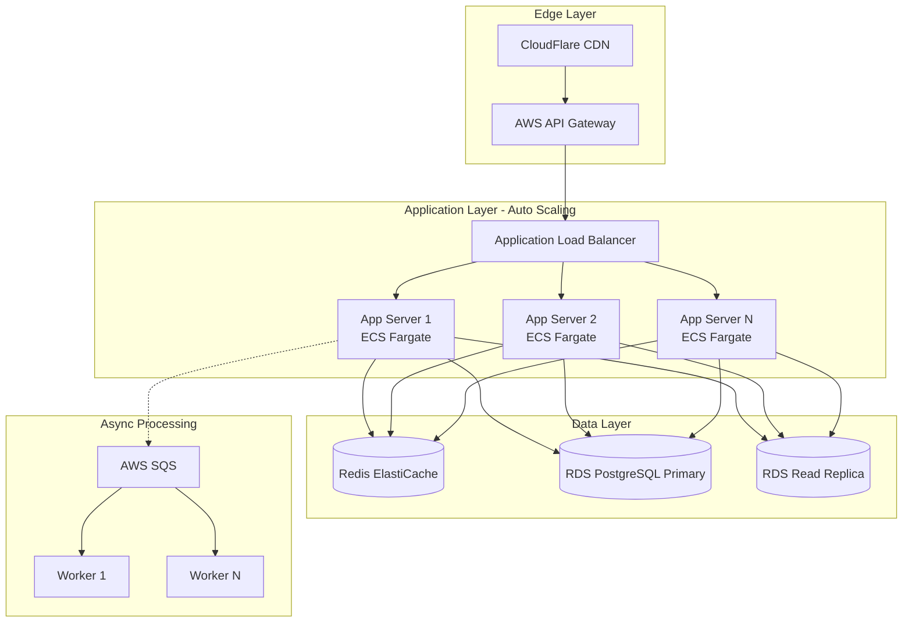

# DOCUMENTAZIONE COMPLETA - SISTEMA GESTIONE RIFIUTI DIGITALE ITALIA
## Piattaforma SaaS per Compliance RENTRI, FIR Digitali e Tracciabilità Rifiuti

**Versione:** 1.0 Master Document
**Data:** 13 Ottobre 2025
**Autore:** AI Development Agency
**Target:** Team di sviluppo, LLM, stakeholder tecnici e business

---

## INDICE NAVIGABILE

1. [Executive Summary](#1-executive-summary)
2. [Contesto Normativo e Compliance Italiana](#2-contesto-normativo-e-compliance-italiana)
3. [Analisi Competitiva e Posizionamento Mercato](#3-analisi-competitiva-e-posizionamento-mercato)
4. [User Personas e Requisiti Funzionali](#4-user-personas-e-requisiti-funzionali)
5. [Architettura Sistema](#5-architettura-sistema)
6. [Piano di Implementazione TDD](#6-piano-di-implementazione-tdd)
7. [Appendici e Riferimenti](#7-appendici-e-riferimenti)

---

## 1. EXECUTIVE SUMMARY

### 1.1 Visione Prodotto

**Piattaforma:** WasteFlow - Sistema SaaS cloud-native per gestione digitale rifiuti in Italia

**Value Proposition:**
*"La piattaforma intelligente che trasforma la gestione rifiuti da obbligo burocratico a vantaggio competitivo"*

**Differenziatori Chiave:**
1. **AI-Powered Simplicity**: Riduzione 70% tempo amministrativo con assistente intelligente
2. **Mobile-First, Offline-Capable**: App nativa per operatori campo (unico nel mercato)
3. **Marketplace Integrato**: Confronto preventivi trasportatori/smaltitori
4. **Economia Circolare Nativa**: Matching automatico simbiosi industriale
5. **Pricing Trasparente**: Da 49€/mese per micro-imprese vs competitor opachi

### 1.2 Opportunità di Mercato

**Dimensione Target:**
- **150.000+ aziende** obbligate RENTRI in Italia
- **80.000-100.000 micro-PMI** segmento sottosservito (target primario)
- **5.000-8.000 consulenti ambientali** (moltiplicatore 1:50)

**Timing Perfetto:**
- Scadenze RENTRI scaglionate 2025-2026 creano urgenza massiva
- Obbligo FIR digitale dal 13 febbraio 2026
- Finanziamenti PNRR: 1.5 miliardi disponibili per digitalizzazione

**Gap Competitivi Identificati:**
1. Nessun competitor ha app mobile nativa completa
2. AI totalmente assente nel mercato
3. Segmento micro-imprese ignorato da player enterprise
4. Marketplace B2B inesistente

### 1.3 Dati Tecnici Chiave

**Architettura:** Monolite Modulare cloud-native (AWS)
**Stack:** Node.js + NestJS, React + Next.js 14, React Native + Expo, PostgreSQL + Redis
**Time-to-Market:** 3.5 mesi (14 settimane, 8 sprint)
**Team:** 5-7 developer (2 Backend, 2 Frontend, 1 Mobile, 1 DevOps, 1 PM)
**Costi Infra MVP:** 700€/mese
**Costi Scala (10K utenti):** 3.300€/mese

**Roadmap:**
- **Sprint 0 (2 settimane)**: Setup infra, CI/CD, test framework
- **Sprint 1-3 (6 settimane)**: Core domain (FIR + Registry + Auth)
- **Sprint 4-5 (4 settimane)**: RENTRI integration + frontend
- **Sprint 6-7 (4 settimane)**: Hardening, security audit, beta test

### 1.4 Metriche di Successo

**Product-Market Fit:**
- Activation: 70% utenti emettono 1° FIR entro 7 giorni
- Retention M1: 60%, M3: 70%
- NPS: >40 MVP, >60 Scale
- North Star Metric: FIR completati end-to-end/mese

**Business:**
- MRR M12: 50K€
- ARR M18: 150K€, M24: 500K€
- CAC: <120€, Payback <6 mesi
- LTV/CAC: >3

### 1.5 Rischi e Mitigazioni

| Rischio | Probabilità | Impatto | Mitigazione |
|---------|-------------|---------|-------------|
| RENTRI API downtime | MEDIA | ALTO | Graceful degradation + queue retry |
| Velocity team <40 SP/sprint | MEDIA | ALTO | Buffer Sprint 7, de-scope se necessario |
| SPID integration complessa | ALTA | MEDIO | Spike 2gg + mock robusto |
| Incumbent (WinWaste) reagisce | BASSA | MEDIO | Focus segmento ignorato (micro-PMI) |

---

## 2. CONTESTO NORMATIVO E COMPLIANCE ITALIANA

### 2.1 RENTRI - Registro Elettronico Nazionale

**Cos'è RENTRI:**
Sistema digitale nazionale obbligatorio che traccia l'intero ciclo di vita dei rifiuti: produzione → trasporto → smaltimento/recupero.

**Gestito da:** Ministero dell'Ambiente e Sicurezza Energetica (MASE)

**Normativa:**
- D.M. 4 aprile 2023 n. 59 (entrato vigore 15 giugno 2023)
- D.L. 116/2020 (istituzione sistema)
- D. Lgs. 152/2006 "Codice dell'Ambiente"

#### Scadenze Iscrizione Obbligatoria

| Fase | Scadenza | Soggetti Obbligati |
|------|----------|-------------------|
| **Fase 1** | ~~13 febbraio 2025~~ (scaduta) | Imprese >50 dipendenti produttori rifiuti pericolosi |
| **Fase 2** | **14 agosto 2025** | Imprese 11-50 dipendenti produttori rifiuti speciali |
| **Fase 3** | **13 febbraio 2026** | Imprese <10 dipendenti + produttori rifiuti pericolosi |

#### Soggetti Obbligati
1. Produttori rifiuti pericolosi (tutte dimensioni)
2. Imprese/enti produttori rifiuti speciali non pericolosi da lavorazioni industriali
3. Trasportatori professionali rifiuti pericolosi
4. Impianti trattamento (recupero/smaltimento)
5. Commercianti e intermediari rifiuti pericolosi

#### API RENTRI Tecniche
- **Ambiente Demo:** `demoapi.rentri.gov.it/docs`
- **Produzione:** `api.rentri.gov.it`
- **Disponibilità:** Dal 23 gennaio 2025
- **Autenticazione:** OAuth 2.0 Client Credentials
- **Rate Limiting:** 100 req/min per client

**Funzionalità API:**
- Vidimazione digitale registri e FIR
- Trasmissione automatizzata dati
- Riconciliazione FIR emessi/ricevuti
- Query storico movimentazioni

---

### 2.2 FIR - Formulario Identificazione Rifiuti

**Cos'è il FIR:**
Documento obbligatorio che accompagna il rifiuto durante trasporto per tracciabilità completa.

**Normativa:**
- Allegati I e II al D.M. 59/2023 (nuovi modelli)
- Decreto Direttoriale 251 del 19/12/2023
- Legge 14 novembre 2024 n. 166

#### Timeline Digitalizzazione

**Fase Attuale (2025):**
- Nuovi modelli cartacei obbligatori dal 15 dicembre 2024
- Vidimazione digitale RENTRI obbligatoria per iscritti

**Digitalizzazione Completa:**
- **Obbligo FIR digitale:** **13 febbraio 2026**
- Tutti operatori iscritti RENTRI devono gestire FIR in formato digitale
- Trasmissione obbligatoria al RENTRI per rifiuti pericolosi

#### Flusso Compilazione

**Soggetti Coinvolti:**
1. **Produttore/Detentore**: Emette FIR prima consegna trasportatore
2. **Trasportatore**: Firma presa in carico, trasporta
3. **Destinatario finale**: Firma accettazione presso impianto

**Campi Obbligatori:**
- **Produttore**: Dati anagrafici, indirizzo, P.IVA, iscrizione RENTRI
- **Rifiuto**: Codice CER (6 cifre), descrizione, quantità (kg/litri), stato fisico, caratteristiche pericolo
- **Trasporto**: Dati trasportatore, iscrizione Albo, data/ora, targa mezzo, colli
- **Destinatario**: Dati impianto, autorizzazioni (AIA/AUA), operazioni destino (codici D/R)
- **Firme Digitali**: Produttore, trasportatore, destinatario

**Conservazione:** 3 anni dall'emissione (D. Lgs. 116/2020)

---

### 2.3 Registri Carico e Scarico

**Cos'è:**
Documento amministrativo cronologico dove si annotano tutte operazioni di produzione, carico, movimentazione e scarico rifiuti.

**Normativa:** D. Lgs. 152/2006 art. 190, D.M. 59/2023

#### Tempistiche Registrazione Obbligatorie

| Tipo Operatore | Operazione | Tempistica |
|----------------|------------|------------|
| **Produttori iniziali** | Carico (produzione) | Entro **10 giorni lavorativi** |
| **Produttori iniziali** | Scarico (conferimento) | Entro **10 giorni lavorativi** |
| **Raccolta/Trasporto** | Carico/Scarico | Entro **10 giorni lavorativi** |
| **Recupero/Smaltimento** | Carico (presa in carico) | Entro **2 giorni lavorativi** |

**NOTA CRITICA:** Giorni lavorativi escludono sabati, domeniche, festivi.

#### Informazioni da Tracciare

**Carico (Produzione):**
- Data produzione, Codice CER, Quantità (kg/litri), Descrizione, Origine (reparto/processo)

**Scarico (Conferimento):**
- Data conferimento, Numero/data FIR, Codice CER, Quantità, Destinatario, Trasportatore

**Registrazione Impianti:**
- Data arrivo, Provenienza, CER ingresso, Quantità, Operazione trattamento (D/R), CER uscita (se trattato)

**Conservazione:** 3 anni dall'ultima registrazione, formato digitale accessibile per ispezioni.

**Sanzioni:** Mancata tenuta o compilazione irregolare: **2.600-15.500 euro**

---

### 2.4 Codici CER/EER - Catalogo Europeo Rifiuti

**Struttura Codice:** 6 cifre `XX YY ZZ`
- **XX**: Capitolo (macro-categoria, es. 02 = rifiuti agricoli)
- **YY**: Sottocapitolo (processo, es. 01 = agricoltura)
- **ZZ**: Rifiuto specifico (es. 01 = scarti corteccia)

**Esempio:** `02 01 01` = Scarti di corteccia e sughero

**Totale Codici:** 900+ codici organizzati in 20 capitoli principali

#### Classificazione Pericoloso/Non Pericoloso

**Identificazione:** Codici pericolosi hanno **asterisco (*)** finale
- `15 01 10*` = Imballaggi contenenti sostanze pericolose (PERICOLOSO)
- `15 01 01` = Imballaggi carta/cartone (NON PERICOLOSO)

**Caratteristiche Pericolo (HP):** HP1-HP15
- HP1: Esplosivo
- HP3: Infiammabile
- HP6: Tossicità acuta
- HP7: Cancerogeno
- HP14: Ecotossico
- ... (totale 15 caratteristiche)

**Codici a Specchio:**
Coppie codici dove uno è pericoloso e l'altro no per stesso tipo rifiuto. Classificazione dipende da presenza sostanze pericolose sopra soglie.

**Responsabilità:** Produttore deve classificare correttamente (eventualmente con analisi chimiche).

#### Requisiti Sistema Gestionale

1. **Database Completo:** Tutti 900+ codici aggiornati, flag pericoloso, descrizione ITA/ENG
2. **Ricerca Intelligente:** Per codice, keyword descrizione, filtro capitolo/pericolosità
3. **Validazione:** Verifica codice esistente, alert rifiuti pericolosi
4. **Aggiornamenti:** Sistema update catalogo, notifica codici obsoleti
5. **Integrazione:** Collegamento automatico obblighi per categoria, suggerimento operazioni D/R ammesse

---

### 2.5 MUD e Altri Adempimenti

#### MUD - Modello Unico Dichiarazione Ambientale

**Cos'è:** Comunicazione annuale obbligatoria con quantità e tipologia rifiuti prodotti/gestiti anno precedente.

**Normativa:** DPCM 29 gennaio 2025, Legge 70/1994

**Scadenza MUD 2025:**
- **Dati riferimento:** Anno 2024
- **Scadenza:** **28 giugno 2025** (120 gg da pubblicazione G.U.)

**Soggetti Obbligati:**
1. Produttori rifiuti pericolosi (tutte dimensioni)
2. Produttori rifiuti non pericolosi con >10 dipendenti
3. Raccolta/trasporto, recupero/smaltimento
4. Commercio/intermediazione rifiuti
5. Comuni (MUD Comuni per rifiuti urbani)

**Sezioni:** Rifiuti Speciali, RAEE, VFU, Imballaggi, Rifiuti Urbani

**Modalità:** Online via SPID/CIE su mudtelematico.it, diritti segreteria 10€

**Sanzioni:** Mancata/errata presentazione: **2.000-10.000 euro**

#### Altri Adempimenti

**Comunicazione AUA:** Entro 30 aprile ogni anno (aziende con Autorizzazione Unica Ambientale)

**Report ISPRA/ARPA:** Trimestrali per impianti su quantitativi trattati

**Contributo CONAI:** Dichiarazione mensile/trimestrale imballaggi immessi

---

### 2.6 Calendario Operativo 2025-2026

**Q2 2025 (Aprile-Giugno):**
- 30 aprile: Contributo RENTRI 2025
- 28 giugno: Scadenza MUD 2025

**Q3 2025 (Luglio-Settembre):**
- **14 agosto: Scadenza iscrizione RENTRI Fase 2** (imprese 11-50 dipendenti)

**Q4 2025 (Ottobre-Dicembre):**
- 15 dicembre: Apertura iscrizioni RENTRI Fase 3

**Q1 2026 (Gennaio-Marzo):**
- **13 febbraio: Scadenza iscrizione RENTRI Fase 3** (imprese <10 dipendenti)
- **13 febbraio: FIR DIGITALE OBBLIGATORIO per tutti**

---

## 3. ANALISI COMPETITIVA E POSIZIONAMENTO MERCATO

### 3.1 Panoramica Mercato Italiano

**Contesto:** Trasformazione digitale accelerata guidata da RENTRI obbligatorio

**Dimensioni:**
- Oltre **150.000 aziende** potenzialmente obbligate
- Prevalenza **PMI** (oltre 80% target)
- Finanziamenti PNRR: **1.5 miliardi** per digitalizzazione

**Trend Chiave:**
1. Obbligatorizzazione RENTRI (timing perfetto per nuovo prodotto)
2. Sostenibilità e ESG reporting (carbon footprint)
3. Economia circolare (End of Waste, incentivi riutilizzo)
4. AI generativa (ChatGPT cambia aspettative UX)
5. Mobile e lavoro remoto (operatori vogliono gestire da smartphone)
6. Modelli SaaS subscription (preferenza cloud, no installazioni)

---

### 3.2 Competitor Principali - Analisi Dettagliata

#### 3.2.1 WinWaste (NICA / Gruppo Zucchetti) - LEADER MERCATO

**Dati:**
- **Clienti:** 2.500+ aziende
- **Proprietario:** NICA Srl (1988) → Zucchetti (2018)
- **Posizionamento:** Enterprise, tutta la filiera

**Punti di Forza:**
- Brand consolidato 35+ anni esperienza
- Copertura funzionale completa (FIR, Registri, MUD, O.R.S.O., End of Waste, Miscelazioni)
- Integrazione RENTRI certificata
- Architettura multiaziendale (999 magazzini EER)
- Ecosistema Zucchetti (Digital HUB integrazione fiscale)
- Rete distribuzione capillare (~50 professionisti assistenza)

**Punti di Debolezza:**
- Prezzo non pubblicato (presumibilmente premium)
- Complessità: sovradimensionato per micro-imprese
- Curva apprendimento ripida
- Lock-in ecosistema Zucchetti
- Interfaccia tradizionale, non mobile-first

**Target:** Medie/grandi imprese filiera rifiuti, aziende che cercano soluzione enterprise con integrazione ERP

---

#### 3.2.2 Rifiutoo (Sfridoo) - CHALLENGER INNOVATIVO

**Dati:**
- **Clienti:** 2.000+ aziende e consulenti
- **Proprietario:** Sfridoo (startup economia circolare)
- **Posizionamento:** Produttori iniziali, consulenti ambientali

**Punti di Forza:**
- Cloud-native moderno
- Semplicità uso e onboarding rapido
- Focus produttori iniziali (funzionalità tarate)
- Assistenza proattiva (recensioni positive)
- Pricing trasparente pubblico
- Community e contenuti educativi
- Integrazione RENTRI certificata

**Punti di Debolezza:**
- Copertura limitata: meno adatto trasportatori/impianti complessi
- Maturità prodotto: azienda giovane vs competitor storici
- Ecosistema integrazioni limitato
- Analisi/reportistica meno sofisticata

**Target:** Piccole/medie imprese produttrici iniziali, consulenti con portafoglio clienti

---

#### 3.2.3 Ambiente.it / ECOS (Terranova Software) - LEADER UTILITY

**Dati:**
- **Market Share:** 12+ milioni utenti TARI (1 bolletta su 5 in Italia)
- **Esperienza:** 25+ anni settore
- **Posizionamento:** Utility ambientali, grandi impianti

**Punti di Forza:**
- Suite completa ECOS (ECOS4UTILITY, ECOS4BUSINESS, ECOS4WASTE)
- Scalabilità multi-company gruppi complessi
- Affidabilità e certificazioni
- Esperienza consolidata 25+ anni
- Top 100 Software Companies 2024

**Punti di Debolezza:**
- Complessità: overkill per micro-imprese
- Prezzo non pubblicato (fascia alta)
- Tempo implementazione lungo
- Curva apprendimento ripida

**Target:** Multiutility, grandi impianti, gruppi industriali multi-sede, operatori igiene urbana

---

#### 3.2.4 QuiRifiutiPro (Buffetti) - ACCESSIBILE PMI

**Dati:**
- **Proprietario:** Buffetti (marchio storico cancelleria)
- **Posizionamento:** PMI, consulenti, professionisti RSPP

**Punti di Forza:**
- Semplicità uso (operativo in minuti)
- Vidimazione online ViViFir (integrazione Ecocamere)
- Gestione multicliente per consulenti
- Cloud-based accesso ovunque
- Brand familiare Buffetti

**Punti di Debolezza:**
- Funzionalità avanzate limitate
- Innovazione: funzionale ma non all'avanguardia
- Ecosistema integrazioni limitato

**Target:** Piccole imprese, artigiani, consulenti con parco clienti PMI

---

#### 3.2.5 PrometeoRifiuti (Informatica EDP) - SEMPLICITA FILIERA

**Dati:**
- **Installazioni:** 1.500+, 2.000+ aziende
- **Posizionamento:** Tutta la filiera

**Punti di Forza:**
- Semplicità per utenti non tecnici
- Integrazione registro-formulario automatica
- Controllo giacenze e MPS
- Export MUD collegamento diretto
- Fatturazione automatica
- Flessibilità cloud/on-premise
- Early adopter RENTRI

**Punti di Debolezza:**
- Brand awareness limitata
- Interfaccia funzionale ma non moderna
- Presenza online limitata

**Target:** PMI filiera rifiuti, comuni aree ecologiche, consulenti

---

### 3.3 Matrice Comparativa Funzionalità

| Feature | WinWaste | Rifiutoo | Ambiente.it | QuiRifiutiPro | PrometeoRifiuti | **WasteFlow (Nostro)** |
|---------|----------|----------|-------------|---------------|-----------------|------------------------|
| **FIR Digitale** | ⭐⭐⭐ | ⭐⭐ | ⭐⭐⭐ | ⭐⭐ | ⭐⭐ | **⭐⭐⭐ + AI** |
| **Registri C/S** | ⭐⭐⭐ | ⭐⭐ | ⭐⭐⭐ | ⭐⭐ | ⭐⭐ | **⭐⭐⭐** |
| **RENTRI Integration** | ⭐⭐⭐ | ⭐⭐⭐ | ⭐⭐⭐ | ⭐⭐ | ⭐⭐ | **⭐⭐⭐** |
| **MUD Automatico** | ⭐⭐⭐ | ⭐⭐ | ⭐⭐⭐ | ⭐⭐ | ⭐⭐ | **⭐⭐⭐** |
| **App Mobile Nativa** | ✗ | ✗ | ⭐ | ✗ | ✗ | **⭐⭐⭐ NUOVO** |
| **AI/Automazione** | ✗ | ✗ | ✗ | ✗ | ✗ | **⭐⭐⭐ NUOVO** |
| **Marketplace B2B** | ✗ | ✗ | ✗ | ✗ | ✗ | **⭐⭐⭐ NUOVO** |
| **Economia Circolare** | ⭐⭐⭐ | ✗ | ⭐⭐ | ✗ | ⭐ | **⭐⭐⭐** |
| **Pricing Trasparente** | ✗ | ⭐⭐⭐ | ✗ | ⭐⭐ | ✗ | **⭐⭐⭐** |
| **Target Micro-PMI** | ✗ | ⭐⭐⭐ | ✗ | ⭐⭐⭐ | ⭐⭐ | **⭐⭐⭐** |

**Legenda:**
⭐⭐⭐ = Eccellente | ⭐⭐ = Buono | ⭐ = Base | ✗ = Assente

---

### 3.4 Gap Analysis - Opportunità Differenziazione

#### GAP 1: App Mobile Nativa Completa
**Problema:** Nessun competitor offre app mobile nativa completa. Interfacce datate, non ottimizzate per tablet/smartphone.

**Opportunità WasteFlow:**
- App iOS/Android nativa con React Native
- Funzionalità offline-first per autisti (zone senza copertura)
- Firma digitale FIR da smartphone touch-screen
- Scansione QR code per caricamento rapido
- Design UX mobile-first moderno

**Impatto:** Differenziatore critico per autisti trasportatori e operatori campo

---

#### GAP 2: Intelligenza Artificiale e Automazione
**Problema:** IA limitata o totalmente assente. Nessun assistente intelligente, nessun analytics predittivo.

**Opportunità WasteFlow:**
- **Assistente AI**: Suggerimento CER corretto da descrizione testo libero
- **Auto-compilazione FIR**: Basata su storico e pattern aziendali
- **Previsioni**: Produzione rifiuti e costi smaltimento futuro
- **Anomaly Detection**: Alert automatico incongruenze registri
- **Chatbot Normativo**: RAG su decreti ambientali per Q&A normative

**Impatto:** Riduzione 70% tempo amministrativo, onboarding self-service

---

#### GAP 3: Marketplace e Matching Domanda/Offerta
**Problema:** Software limitati a gestione documentale. Nessuna piattaforma per trovare trasportatori/smaltitori. Confronto prezzi manuale.

**Opportunità WasteFlow:**
- Marketplace integrato preventivi smaltimento
- Sistema rating/recensioni trasportatori certificati
- Matching automatico produttore-trasportatore-impianto ottimale
- Network effect: più utenti = più offerte = più valore

**Impatto:** Revenue aggiuntivo (3% commissione), riduzione costi utenti 10-15%, moat competitivo

---

#### GAP 4: Economia Circolare e End of Waste
**Problema:** Solo WinWaste e Ambiente.it gestiscono End of Waste. Mancanza strumenti valorizzazione sottoprodotti.

**Opportunità WasteFlow:**
- Modulo dedicato con suggerimenti riutilizzo
- Matching automatico: scarti azienda A → materia prima azienda B
- Dashboard sostenibilità con KPI ambientali e carbon footprint
- Opportunità simbiosi industriale

**Impatto:** ESG reporting, vantaggio competitivo sostenibilità

---

#### GAP 5: Integrazione IoT e Sensori Smart
**Problema:** Nessun competitor integra nativamente dati bilance/sensori IoT. Gestione pesi manuale.

**Opportunità WasteFlow:**
- Integrazione bilance intelligenti per pesatura automatica FIR
- Sensori riempimento container con alert soglia
- Tracking GPS mezzi trasporto real-time
- Dashboard operations real-time

**Impatto:** Risparmio tempo registrazioni, ottimizzazione logistica

---

#### GAP 6: Compliance Proattiva
**Problema:** Aggiornamenti normativi comunicati ma non contestualizzati. Nessun alert proattivo scadenze.

**Opportunità WasteFlow:**
- Calendario intelligente scadenze personalizzato azienda
- Alert automatici violazioni/rischi compliance
- Dashboard compliance score con raccomandazioni
- Integrazione normativa aggiornamenti automatici

**Impatto:** Zero multe dimenticanza, peace of mind utenti

---

### 3.5 Posizionamento Strategico WasteFlow

#### Value Proposition Unica

**"La piattaforma intelligente che trasforma la gestione rifiuti da obbligo burocratico a vantaggio competitivo"**

**Differenziatori (5 Pilastri):**

1. **AI-Powered Simplicity**
   - Assistente guida passo-passo
   - Auto-compilazione documenti con ML
   - Riduzione 70% tempo amministrativo

2. **Mobile-First, Offline-Capable**
   - App nativa iOS/Android
   - Firma digitale FIR da smartphone
   - Offline mode con sync automatica

3. **Marketplace Integrato**
   - Confronto preventivi in piattaforma
   - Rating e recensioni verificate
   - Ottimizzazione costi smaltimento

4. **Economia Circolare Nativa**
   - Valorizzazione scarti come opportunità
   - Matching simbiosi industriale
   - Dashboard sostenibilità e CO2

5. **Pricing Trasparente**
   - Piani chiari da 49€/mese micro-imprese
   - Free tier consulenti <5 clienti
   - Zero costi setup, attivazione immediata

---

#### Segmenti Target Prioritari

**SEGMENTO 1: Micro/Piccole Imprese Produttrici Iniziali (PRIMARIO)**

**Dimensione:** 80.000-100.000 aziende

**Caratteristiche:**
- <50 dipendenti, spesso <10
- Rifiuti non core business
- Budget <100€/mese
- Bassa alfabetizzazione digitale-ambientale
- Obbligo RENTRI 2025-2026

**Perché Vincente:**
- Segmento sottosservito (competitor troppo complessi/costosi)
- Margini alti se standardizzato self-service
- Land-and-expand: acquisizione economica, upsell futuro
- Network effect: passaparola tra PMI

**Posizionamento:** *"Il software che ogni artigiano usa, senza consulenti esterni"*

---

**SEGMENTO 2: Consulenti Ambientali (SECONDARIO STRATEGICO)**

**Dimensione:** 5.000-8.000 professionisti

**Caratteristiche:**
- Gestiscono 10-100+ clienti ciascuno
- Multiaziendale necessario
- Sensibili a efficienza
- Influenzatori (raccomandano software)

**Perché Vincente:**
- **Effetto leva:** 1 consulente porta 20-50 aziende clienti
- **Stickiness:** Switching cost alto con parco clienti caricato
- **Champions:** Promotori attivi prodotto
- Recurring revenue prevedibile

**Posizionamento:** *"La piattaforma che moltiplica produttività consulenti, gestendo più clienti in meno tempo"*

---

**SEGMENTO 3: Trasportatori Piccoli/Medi (TERZIARIO)**

**Dimensione:** 3.000-5.000 aziende

**Caratteristiche:**
- Gestione flotte e tracciabilità real-time
- GPS e planning ottimizzato
- Margini stretti, focus efficienza

**Perché Differenziante:**
- Modulo mobile autisti con firma digitale
- Ottimizzazione route con AI
- Dashboard real-time operations

**Posizionamento:** *"Il control center che ottimizza operazioni e riduce costi logistici"*

---

#### Go-to-Market Strategy

**Fase 1: Beachhead (Mesi 1-6)**
- **Target:** Consulenti ambientali early adopters
- **Tattica:** Free tier generoso, onboarding white-glove, co-marketing
- **Obiettivo:** 50 consulenti con 500+ aziende clienti aggregate

**Fase 2: Land (Mesi 7-18)**
- **Target:** PMI produttrici Lombardia/Veneto/Emilia-Romagna
- **Tattica:** Content marketing SEO ("come adeguarsi RENTRI"), partnership associazioni, webinar
- **Obiettivo:** 1.000 aziende paganti, NPS >50

**Fase 3: Expand (Mesi 19-36)**
- **Target:** Espansione geografica Italia, upsell premium
- **Tattica:** Marketplace attivato, moduli AI avanzati, integrazioni ERP
- **Obiettivo:** 5.000+ aziende, penetrazione trasportatori

---

#### Moat Competitivo (Barriere)

1. **Network Effect:** Marketplace più aziende = più trasportatori = più valore
2. **Data Moat:** Più dati = modelli AI migliori = raccomandazioni accurate
3. **Integration Lock-in:** Integrazioni native gestionali popolari (Fatture in Cloud, TeamSystem)
4. **Community:** Blog, guide, forum punto riferimento settore
5. **Brand Reputation:** "Il software facile per PMI" difficile replicare

---

### 3.6 Sintesi Competitiva

**Scenario:** Mercato dominato da 2-3 player enterprise (WinWaste, Ambiente.it) con soluzioni complete ma complesse/costose. 5-10 challenger competono su segmenti specifici.

**Gap Più Significativi:**
1. Mobile-first: Nessuno ha app nativa completa
2. AI: Totalmente assente
3. Marketplace B2B: Inesistente
4. Pricing accessibile: Solo 2-3 pubblicano listini
5. Economia circolare: Strumenti dedicati quasi inesistenti

**Sweet Spot:** Micro/piccole imprese produttrici + Consulenti ambientali. Segmento 80.000+ aziende, sottosservito, budget limitato ma obbligo normativo imminente.

**Finestra Opportunità:** 2025-2026 scadenze RENTRI creano urgenza mercato con ondata nuovi clienti che devono digitalizzarsi.

---

## 4. USER PERSONAS E REQUISITI FUNZIONALI

### 4.1 User Personas Dettagliate

#### PERSONA 1: Marco Ferri - Piccolo Produttore Artigiano

**Profilo:**
- Titolare Officina Meccanica, 52 anni, Bergamo
- 8 dipendenti, fatturato 800K€/anno
- Rifiuti pericolosi: oli esausti, solventi, metalli contaminati
- Obbligo RENTRI Fase 3 (febbraio 2026)

**Obiettivi:**
1. Evitare sanzioni, rimanere compliant
2. Minimizzare tempo burocrazia (focus produzione)
3. Ridurre costi smaltimento
4. Non assumere consulente esterno

**Pain Points:**
- "Non ho tempo per studiare 100 pagine normative, devo fatturare"
- Paura sbagliare codice CER e ricevere multa
- Fermare produzione per compilare registri cartacei
- Non sa mai quando scadono adempimenti
- Software competitor "troppo complicato, ho rinunciato"

**Comportamenti Tech:**
- Smartphone Android, WhatsApp, email
- Non ha SPID (dovrà attivarsi)
- Gestisce fatture con Fatture in Cloud
- Diffidente verso "software costosi"

**Metriche Successo:**
- Tempo gestione rifiuti: <2 ore/mese (ora 6-8h)
- Costo software: max 50€/mese
- Onboarding: "Se non capisco in 30 min, cambio"
- Zero multe/sanzioni

**Citazioni:**
> "Voglio solo sapere: questo rifiuto dove lo butto e quanto mi costa. Stop."

> "I software sembrano fatti per ingegneri nucleari. Io ho la terza media."

---

#### PERSONA 2: Elena Rossi - Consulente Ambientale Multitasking

**Profilo:**
- Consulente HSE, 38 anni, Milano
- Studio 3 soci, gestisce 35 aziende clienti
- Portfolio: PMI manifatturiere 10-80 dipendenti
- Fatturato servizio rifiuti: 45K€/anno

**Obiettivi:**
1. Gestire più clienti senza errori
2. Scalare business senza assumere
3. Offrire servizio premium con reportistica
4. Automatizzare task ripetitivi

**Pain Points:**
- Accedere a 35 account diversi
- Perde 10h/settimana ricopiare dati da email/foto
- Quando arriva ispezione cliente: 2h per trovare tutto
- Clienti chiamano in panico: "Elena, FIR marzo 2023!"
- Non ha visibilità aggregata scadenze tutti clienti

**Comportamenti Tech:**
- Power user: Trello, Excel avanzato, ERP
- Tablet per visite in azienda
- Vorrebbe app mobile compilazione on-site
- Disposta pagare tool professionali se risparmiano tempo

**Metriche Successo:**
- Tempo per cliente: <30 min/mese (ora 1.5h)
- Gestire 50+ clienti senza assistente
- Riduzione chiamate urgenti 70%
- Upselling servizi premium

**Citazioni:**
> "Dashboard dove vedo tutti i 35 clienti: chi ha scadenze, anomalie, chi richiamare."

> "Se risparmio 1h/settimana per cliente, accetto 10 clienti in più l'anno prossimo."

---

#### PERSONA 3: Luca Martini - Trasportatore Efficiente

**Profilo:**
- Titolare Trasporti Rifiuti, 45 anni, Bologna
- Flotta 12 automezzi specializzati
- 18 dipendenti, 400+ movimentazioni/mese
- Iscritto Albo Gestori Cat. 5

**Obiettivi:**
1. Ottimizzare route e riempimento mezzi
2. Tracciabilità real-time clienti/autisti
3. Eliminare errori compilazione FIR campo
4. Ridurre tempo amministrativo chiusura documenti

**Pain Points:**
- Autisti compilano FIR a mano, errori/illeggibile
- Non sa real-time dove sono mezzi e quanto caricato
- Litiga con clienti su pesi ("800kg vs 750kg")
- FIR cartacei tornano dopo giorni, rallenta fatturazione
- Difficile pianificare: "Mezzo può fare ancora un giro?"

**Comportamenti Tech:**
- Software gestionale flotte (GPS tracker)
- Autisti con smartphone aziendale
- Vorrebbe integrazione bilancia → FIR automatico
- Dashboard real-time operations

**Metriche Successo:**
- Aumento carico mezzi +15%
- Riduzione errori FIR: 12% → <2%
- Fatturazione più veloce +5 giorni
- Clienti vedono stato trasporto autonomamente

**Citazioni:**
> "Autista fa foto rifiuto, compila FIR da cellulare con firma digitale, io in ufficio vedo tutto real-time."

> "Un giro in più al giorno per mezzo = +50K fatturato annuo."

---

#### PERSONA 4: Giovanni Bianchi - Gestore Impianto Recupero

**Profilo:**
- Responsabile Operativo Impianto, 50 anni, Brescia
- Impianto recupero metalli e RAEE
- 45 dipendenti, 3 turni, 5.000+ ton/anno
- AIA, iscritto RENTRI Fase 1

**Obiettivi:**
1. Compliance rigorosa (errore = sospensione)
2. Tracciabilità completa in→out
3. Ottimizzare tempo registrazione (2gg obbligo)
4. Reportistica automatica ARPA e AIA

**Pain Points:**
- 40-60 trasporti/giorno, registrare in 2gg
- Ogni rifiuto ha analisi diverse
- Gestione End of Waste (CER in ≠ CER out)
- ARPA chiede report trimestrali complessi
- Pesatura camion → ricopiare peso su registro
- Rifiuti pericolosi: errore = denuncia penale

**Comportamenti Tech:**
- Software gestionale custom (vecchio)
- Bilance automatiche dati seriale/ethernet
- Vorrebbe integrazione sensori IoT
- Dashboard per direzione e controllo qualità

**Metriche Successo:**
- Tempo registrazione: <5 min/trasporto (ora 15)
- Zero non conformità audit ARPA
- MUD automatico (ora 3 giorni lavoro)
- Integrazione pesatura senza ricopiatura

**Citazioni:**
> "50 camion/giorno. Se registro manuale servirebbero 2 persone solo per quello."

> "ARPA arriva, devo trovare in 10 min tutti documenti rifiuto. Se manca qualcosa, mi chiudono."

---

#### PERSONA 5: Sara Colombo - Environmental Manager Gruppo

**Profilo:**
- Environmental Manager, 42 anni, Torino
- Gruppo manifatturiero 8 stabilimenti Italia
- 1.200 dipendenti, 150M€ fatturato
- ISO 14001, report ESG obbligatorio

**Obiettivi:**
1. Visibilità aggregata multi-site real-time
2. KPI ambientali per board e sostenibilità
3. Benchmark stabilimenti best practice
4. Riduzione costi via economia circolare

**Pain Points:**
- Ogni stabilimento usa software diverso (o Excel)
- No dashboard unica: 1 settimana consolidare dati
- Board chiede carbon footprint: calcolo manuale
- Non sa quale stabilimento produce più pericolosi
- Opportunità simbiosi industriale: non le vede
- Audit ISO 14001: fatica dimostrare miglioramento

**Comportamenti Tech:**
- Power user Excel, Power BI, SAP
- Necessita integrazione ERP corporate
- Software enterprise-grade con API robuste
- Disposta investimento significativo se ROI chiaro

**Metriche Successo:**
- Dashboard real-time 8 stabilimenti
- Riduzione costi -10%/anno (ottimizzazione)
- Report ESG automatico
- Certificazione economia circolare

**Citazioni:**
> "CEO chiede: quanto produciamo pericolosi? Quanta CO2 generiamo? Chiamo 8 responsabili e faccio Excel."

> "Torino produce scarti metallici che Milano compra come materia prima. Ma non ho strumenti per gestire simbiosi."

---

### 4.2 User Stories per Tema

#### TEMA A: Gestione FIR Digitali

**US-A1** (Marco - Produttore)
Come piccolo produttore, voglio compilare FIR in <5 minuti guidato step-by-step, così non devo studiare normativa per ore.

**Criteri Accettazione:**
- Wizard multi-step linguaggio semplice
- Suggerimento CER automatico da descrizione
- Pre-compilazione dati azienda e trasportatore abituale
- Validazione real-time campi obbligatori
- Anteprima PDF pre-conferma

**Ipotesi:** Utenti bassa alfabetizzazione completano FIR senza assistenza. Tasso errore CER <5% con AI.

---

**US-A2** (Luca - Trasportatore)
Come autista, voglio compilare e far firmare FIR da smartphone sul campo, così elimino carta e chiudo tutto subito.

**Criteri Accettazione:**
- App mobile iOS/Android nativa
- Offline mode con sync dopo
- Firma digitale touch-screen produttore
- Scansione QR code caricamento rapido
- Foto allegate FIR per evidenza

**Ipotesi:** Autisti riducono errori >60%. Chiusura FIR da 5gg a <1gg.

---

**US-A3** (Elena - Consulente)
Come consulente 35 clienti, voglio creare FIR da dashboard multiaziendale unica, così non faccio login/logout 35 volte.

**Criteri Accettazione:**
- Selezione rapida cliente da dropdown
- Template FIR salvabili per cliente
- Ricerca storico cross-cliente
- Notifiche aggregate scadenze tutti
- Export massivo FIR per periodo

**Ipotesi:** Consulenti gestiscono +40% clienti stesso tempo. NPS >70.

---

#### TEMA B: Registri Carico/Scarico

**US-B1** (Marco)
Come produttore, voglio registrazioni C/S auto-compilate da FIR, così non riscrivo tutto due volte.

**Criteri:** Auto-generazione scarico da FIR, calcolo giacenze real-time, alert anomalie, export PDF/Excel.

**Ipotesi:** Riduzione tempo registrazione 80%, errori giacenze → zero.

---

**US-B2** (Giovanni - Impianto)
Come gestore, voglio registrare carichi in 2gg con integrazione bilancia automatica, così rispetto tempistiche senza lavoro manuale.

**Criteri:** API bilancia, carico pre-compilato da FIR, workflow approvazione, dashboard giornaliera, alert >48h.

**Ipotesi:** Tempo registrazione -70%, compliance 100%.

---

#### TEMA C: Integrazione RENTRI

**US-C1** (Marco)
Come obbligato RENTRI, voglio sync automatico registri/FIR senza pensarci, così sono sempre compliant senza sforzo.

**Criteri:** Sync notturna automatica, notifica conferma, gestione errori chiara, retry automatico, log storico audit.

**Ipotesi:** Tasso successo >98%, percezione integrazione "trasparente".

---

**US-C2** (Giovanni)
Come impianto, voglio interrogare RENTRI per verificare coerenza FIR ricevuti vs emessi, così individuo anomalie prima ispezioni.

**Criteri:** Riconciliazione automatica, report discrepanze, richiesta rettifica, compliance score dashboard.

**Ipotesi:** Anomalie identificate prima audit. Riduzione non-conformità >80%.

---

#### TEMA D: Reportistica e Compliance

**US-D1** (Marco)
Come piccolo produttore, voglio calendario intelligente con alert 30gg pre-scadenza (MUD, contributi), così non rischio multe.

**Criteri:** Calendario personalizzato profilo, notifica email/SMS configurabile, checklist task, integrazione Google/Outlook.

**Ipotesi:** Riduzione scadenze mancate >90%, calendario "indispensabile".

---

**US-D2** (Elena)
Come consulente, voglio generare MUD pre-compilato per cliente in 10 min, così risparmio 2 giorni lavoro.

**Criteri:** Estrazione dati anno automatica, pre-compilazione sezioni, export XML, verifica coerenza.

**Ipotesi:** Tempo MUD -85%, zero errori incoerenza.

---

**US-D3** (Sara)
Come environmental manager gruppo, voglio dashboard KPI ambientali aggregati real-time per CdA e ISO.

**Criteri:** KPI (ton, %, costi, CO2), filtri periodo/stabilimento/tipo, benchmark tra stabilimenti, export report.

**Ipotesi:** Preparazione report da 1 settimana a <2h, anomalie/opportunità real-time.

---

### 4.3 Requisiti Funzionali MoSCoW

#### MUST HAVE (MVP - Release 0.1)

**Blocco 1: Compliance Fondamentale**

| ID | Funzionalità | Effort |
|----|--------------|--------|
| MH-01 | Gestione anagrafiche (produttore, trasportatore, destinatario) | 5d |
| MH-02 | Database completo Codici CER/EER aggiornato | 3d |
| MH-03 | Emissione FIR digitale conforme D.M. 59/2023 | 8d |
| MH-04 | Registri carico/scarico digitali | 8d |
| MH-05 | Vidimazione digitale documenti | 5d |
| MH-06 | Conservazione documenti 3 anni con ricerca | 3d |
| MH-07 | Integrazione API RENTRI (base) | 13d |
| MH-08 | Autenticazione SPID/CIE per firma digitale | 8d |

**Blocco 2: Usabilità Critica**

| ID | Funzionalità | Effort |
|----|--------------|--------|
| MH-09 | Wizard guidato compilazione FIR | 5d |
| MH-10 | Ricerca intelligente CER (keyword) | 3d |
| MH-11 | Dashboard utente con riassunto stato | 5d |
| MH-12 | Export FIR/Registri PDF | 3d |
| MH-13 | Gestione multiaziendale (consulenti) | 8d |

**Totale Effort MVP:** 75 giorni/persona (~3.5 mesi con team 2 dev)

**Ipotesi Rischiosa:** Utenti bassa alfabetizzazione completano onboarding e primo FIR in <30 min senza supporto.

**Metrica Successo:** 70% utenti beta emettono ≥1 FIR/settimana entro 2 settimane da attivazione.

---

#### SHOULD HAVE (Release 1.x - Post-MVP)

**Blocco 3: Automazione e Produttività**

| ID | Funzionalità | Effort |
|----|--------------|--------|
| SH-01 | Suggerimento automatico CER con AI (LLM) | 8d |
| SH-02 | Template FIR salvabili per cliente | 3d |
| SH-03 | Auto-compilazione registri da FIR | 5d |
| SH-04 | Calendario scadenze intelligente | 5d |
| SH-05 | Notifiche email/SMS scadenze | 3d |
| SH-06 | Pre-compilazione MUD da registri | 8d |
| SH-07 | App mobile iOS/Android nativa | 21d |
| SH-08 | Modalità offline mobile con sync | 8d |

**Blocco 4: Reportistica**

| SH-09 | Dashboard KPI ambientali | 8d |
| SH-10 | Report personalizzabili drag-drop | 13d |
| SH-11 | Export Excel/CSV avanzato | 3d |
| SH-12 | Storico movimenti full-text search | 5d |

**Totale:** 90 giorni/persona

---

#### COULD HAVE (Release 2.x - Crescita)

**Blocco 5: Marketplace**

| CH-01 | Marketplace preventivi trasportatori | 21d |
| CH-02 | Sistema rating/recensioni | 8d |
| CH-03 | Matching automatico | 13d |
| CH-04 | Notifiche simbiosi industriale | 13d |

**Blocco 6: AI Avanzata**

| CH-05 | Ottimizzazione route AI | 13d |
| CH-06 | Previsioni produzione forecasting | 13d |
| CH-07 | Anomaly detection registri | 8d |
| CH-08 | Chatbot normativo RAG | 13d |

**Blocco 7: Integrazioni**

| CH-09 | Integrazione bilance IoT | 13d |
| CH-10 | Integrazione ERP (Zucchetti, TeamSystem) | 21d |
| CH-11 | API pubbliche terze parti | 13d |
| CH-12 | Dashboard ESG carbon footprint | 8d |

**Totale:** 144 giorni/persona

---

#### WON'T HAVE (Fuori Scope)

**Motivazione:** Focus MVP e PMR, evitare feature creep.

- WH-01: Gestione rifiuti urbani (fuori target B2B)
- WH-02: Modulo sicurezza lavoro (fuori core)
- WH-03: Sistema fatturazione integrato (esistono già tool)
- WH-04: CRM gestione commerciale (non differenziante)
- WH-05: Gestione magazzino prodotti (fuori scope)
- WH-06: White-label rivenditori (complessità prematura)
- WH-07: Blockchain tracking (hype senza valore provato)

**Rivalutazione:** Post Serie A o traction >5.000 utenti paganti.

---

### 4.4 Requisiti Non Funzionali

#### Performance
- RNF-P1: Response time <2s (P95)
- RNF-P2: Dashboard <3s con 1000+ FIR
- RNF-P3: 1.000 utenti concorrenti peak
- RNF-P4: Sync mobile offline→online <10s

**Validazione:** Lighthouse >90, Core Web Vitals "Good"

---

#### Sicurezza e Privacy
- RNF-S1: TLS 1.3 tutte comunicazioni
- RNF-S2: AES-256 dati a riposo (DB)
- RNF-S3: GDPR completo (DPO, registro trattamenti)
- RNF-S4: 2FA opzionale utenti
- RNF-S5: Audit log completo WORM
- RNF-S6: Backup giornalieri retention 90gg
- RNF-S7: DR con RTO <4h, RPO <1h

**Certificazioni Target:** ISO 27001 (post Serie A)

---

#### Scalabilità
- RNF-SC1: Cloud-native auto-scaling
- RNF-SC2: DB sharding per >100K aziende
- RNF-SC3: CDN latency <100ms
- RNF-SC4: Cache Redis intelligente

**Obiettivo:** Crescita 10x senza refactoring

---

#### Disponibilità
- RNF-D1: Uptime >99.5% (SLA)
- RNF-D2: Manutenzioni fuori picco
- RNF-D3: Monitoring real-time Datadog/New Relic
- RNF-D4: Health check endpoint
- RNF-D5: Graceful degradation RENTRI down

---

#### Usabilità
- RNF-U1: WCAG 2.1 Level AA
- RNF-U2: Browser: Chrome, Firefox, Safari, Edge (ultime 2 versioni)
- RNF-U3: Design responsive mobile-first (320px)
- RNF-U4: Onboarding guidato tooltips
- RNF-U5: Help in-app ricerca contestuale
- RNF-U6: Lingua italiana (inglese roadmap)

**Validazione:** SUS score >75

---

### 4.5 Flussi Utente Critici

#### FLUSSO 1: Creazione FIR Completo End-to-End

**Attori:** Marco (Produttore), Luca (Trasportatore), Giovanni (Destinatario)

**Step Principali:**

1. **Marco (Produttore):**
   - Login SPID → Dashboard
   - Click "Nuovo FIR" → Wizard
   - Step 1: Descrive rifiuto "olio motore esausto" → AI suggerisce CER `13 02 05*` → Conferma → Quantità 120 kg
   - Step 2: Seleziona trasportatore da rubrica "Trasporti Martini"
   - Step 3: Seleziona destinatario "Recupero Metalli Bianchi" (sistema verifica AIA valida)
   - Step 4: Anteprima PDF → "Firma e Invia" → Autentica SPID
   - Sistema genera FIR progressivo, invia notifica Luca, pre-registra scarico, invia RENTRI

2. **Luca (Trasportatore) - App Mobile:**
   - Riceve notifica "Nuovo ritiro"
   - Arriva presso Marco → Scansiona QR code FIR
   - Verifica quantità → Fa firmare Marco su tablet touch
   - "Presa in carico confermata" → Sistema aggiorna FIR "In Transito", sync RENTRI

3. **Giovanni (Destinatario):**
   - Camion passa su bilancia → Sistema legge peso 118 kg automatico
   - Operatore tablet: Scansiona QR FIR → Pre-compilato peso bilancia
   - Verifica visiva coerente → "Accetta carico" → Firma digitale
   - Sistema chiude FIR "Consegnato", registra carico impianto, conferma scarico Marco, sync RENTRI finale

**Postcondizioni:** FIR completo vidimato, registri aggiornati automaticamente, tracciabilità end-to-end.

**Tempo:** 8 minuti totali (vs 30 min cartaceo)

**Ipotesi:** Riduzione >70%, completamento senza errori >95%, NPS >60.

---

#### FLUSSO 2: Registrazione Carichi Impianto

**Attore:** Giovanni

**Scenario:** 40 camion arrivati oggi, obbligo registrazione entro 2gg

**Flusso:**
1. Login → "Carichi da registrare"
2. Lista 40 FIR in attesa, ordinati per data (alert rosso se >36h)
3. Seleziona primo FIR: dati già completi da API, peso da bilancia già acquisito
4. Verifica campione fisico OK, autorizzazione AIA OK (validato sistema)
5. "Registra carico" → Sistema crea riga registro, aggiorna giacenze, invia RENTRI, segna "Registrato"
6. Ripete per altri 39: tempo medio <2 min/FIR

**Postcondizioni:** 40 carichi registrati in tempo, giacenze aggiornate, compliance 100%

**Tempo:** 80 minuti per 40 (vs 6 ore manuale) → -60% tempo

**Resilienza:** Se RENTRI offline → registra locale + queue retry automatico → sync quando torna online

---

#### FLUSSO 3: Generazione MUD Annuale

**Attore:** Elena (Consulente per cliente Marco)

**Scenario:** Anno 2024 chiuso, scadenza MUD 28 giugno 2025

**Flusso:**
1. Login → Selezione cliente "Officina Ferri Marco"
2. "Adempimenti" → "Genera MUD 2025"
3. Step 1: Verifica dati aziendali (pre-compilati) → OK
4. Step 2: Seleziona anno 2024 → Sistema calcola: 4.850 kg totale, 66% pericolosi, 34% non pericolosi
5. Step 3: Dettaglio per CER (tabella aggregata automatica da registri)
6. Step 4: Operazioni destino rilevate automaticamente
7. Elena verifica coerenza (3 min) → "Genera XML"
8. Sistema genera XML schema MUD Telematico 2025, valida XSD → "0 errori"
9. Elena scarica XML, upload su mudtelematico.it → Invio OK
10. Torna gestionale → "Segna MUD inviato" → Calendario aggiornato ✓

**Ripete per 34 clienti:** Tempo 10 min/cliente (vs 3h manuale) → Totale 6h (vs 105h = 13 giorni) → -95% tempo

**Postcondizioni:** MUD inviato in tempo, storico tracciato, Elena ha risparmiato 99 ore.

**Ipotesi:** Errori XML <1%, NPS consulenti post-MUD >80, disposti pagare premium.

---

### 4.6 Metriche di Successo Build-Measure-Learn

#### Fase MVP (Mesi 1-3)
- **Activation:** 70% emettono 1° FIR entro 7gg
- **Engagement:** 3+ FIR/mese per utente attivo
- **Retention M1:** 60%
- **NPS:** >40 (acceptable early adopters)
- **Time-to-value:** <30 min onboarding → 1° FIR

#### Fase Growth (Mesi 4-12)
- **MAU:** 500 → 2.000
- **Retention M3:** >70%
- **NPS:** >50
- **Viral coefficient:** 0.3 (consulenti portano clienti)
- **Feature adoption:** 60% usa calendario scadenze

#### Fase Scale (Mesi 13-24)
- **MAU:** 2.000 → 10.000
- **NPS:** >60
- **CAC payback:** <6 mesi
- **LTV/CAC:** >3
- **Churn mensile:** <3%

#### Metriche Business
- **MRR M12:** 50K€
- **ARR:** M18: 150K€, M24: 500K€
- **ARPU:** 40-60€/mese
- **CAC:** <120€
- **Infra cloud:** <15% MRR

#### North Star Metric
**Numero FIR completati end-to-end (firma digitale tutti attori) per mese**

**Leading Indicators:**
- Nuovi utenti attivati/settimana
- FIR creati/utente/mese
- Tempo medio completamento FIR
- Tasso errori FIR (<5%)

---

### 4.7 Assunzioni Rischiose e Piani Validazione

#### Assunzione 1: "PMI bassa alfabetizzazione usano autonomamente"

**Rischio:** ALTO - Se fallisce, serve supporto 1:1 costoso non scalabile

**Piano Validazione MVP:**
1. Reclutare 20 PMI profilo Marco
2. Onboarding con screen recording + thinking aloud
3. Misurare: completamento, time-to-first-FIR, richieste aiuto
4. Soglia: 70% completa senza aiuto

**Pivot se Fallisce:**
- Semplificare UI ulteriormente (ridurre campi)
- Video tutorial contestuali
- Chatbot assistente passo-passo

---

#### Assunzione 2: "Consulenti diventano champions e portano clienti"

**Rischio:** MEDIO - Se fallisce, CAC aumenta, crescita rallenta

**Piano Validazione:**
1. Free tier consulenti <5 clienti
2. Programma referral: 20% commissione ricorrente
3. Misurare: viral coefficient, NPS, clienti portati/consulente
4. Soglia: 1 cliente ogni 3 consulenti

**Pivot se Fallisce:**
- Marketing diretto PMI (SEO, Google Ads)
- Partnership associazioni (Confartigianato)

---

#### Assunzione 3: "Marketplace genera revenue incrementale"

**Rischio:** BASSO (non core MVP) - Ma se funziona è moat

**Piano Validazione:**
1. MVP marketplace: 5 trasportatori test Lombardia
2. Misurare: % richiede preventivo, conversion
3. Revenue: 3% commissione
4. Soglia: 10% utenti attivi usa, 30% conversion

**Pivot se Fallisce:**
- Semplificare in directory trasportatori (no transazioni)
- Focus analytics vs marketplace

---

## 5. ARCHITETTURA SISTEMA

### 5.1 Decisioni Architetturali Principali

**Pattern:** **Monolite Modulare con Domain-Driven Design**

**Motivazione:**
- **PRO:** Time-to-market velocissimo, team piccolo (5-7), transazioni ACID native, debugging semplice, costi infra bassi
- **CONTRO:** Scaling granulare limitato, deploy monolitico, rischio accoppiamento (mitigato con disciplina)
- **ALTERNATIVA RIGETTATA:** Microservizi → overhead ops sproporzionato per MVP, +40% time-to-market, costi +70%

**Quando Riconsiderare Microservizi:** >10K utenti, team >15 dev, esigenze scaling eterogenee

#### Strategia Migrazione Futura
- Moduli come Bounded Contexts autonomi
- Event bus interno (in-memory MVP, RabbitMQ poi)
- Schema DB logicamente separati (stesso PostgreSQL)
- Exit strategy: estrarre moduli alto carico quando necessario

---

### 5.2 Stack Tecnologico

#### Backend
**SCELTA:** Node.js 20 LTS + NestJS (TypeScript)

**Motivazione:**
- TypeScript end-to-end (unico linguaggio team)
- Ecosistema maturo npm
- Performance adeguata I/O-bound
- Pool dev ampio e cost-effective
- NestJS: DDD-friendly, modules, dependency injection

**Alternativa Considerata:** Python + FastAPI, Go + Gin, Java + Spring → Rigettate per velocity inferiore o team cost

---

#### Frontend Web
**SCELTA:** React 18 + Next.js 14 (App Router) + TailwindCSS

**Motivazione:**
- Next.js 14 Server Components (performance, SEO)
- React dominance (largest ecosystem, hiring facile)
- TypeScript safety (shared types backend)
- TailwindCSS rapid UI development
- Vercel zero-config deploy

**Alternativa:** Vue.js/Nuxt, Svelte → Pool dev più piccolo, meno librerie

---

#### Mobile
**SCELTA:** React Native + Expo (Managed Workflow)

**Motivazione:**
- Code sharing 80% iOS/Android, 50% con web
- Time-to-market single codebase vs 2 team
- Expo: OTA updates, notifications, build service
- Cost: -60% vs native teams

**Trade-off:** Performance -10% vs native (accettabile per form-based app)

**Quando Riconsiderare Native:** Se UX score <70 o performance complaints >5%

---

#### Database
**SCELTA:** PostgreSQL 16 (Primary) + Redis 7 (Cache/Queue)

**Motivazione PostgreSQL:**
- ACID compliance (transazioni critiche compliance)
- JSON support (flessibilità senza schema rigido)
- Full-text search (CER senza Elasticsearch)
- Maturità 30+ anni
- Row-Level Security multi-tenancy
- PostGIS per geolocation future

**Alternativa:** MongoDB (ACID debole), MySQL, CockroachDB (costo prematuro)

**Redis Utilizzo:**
- Session store, cache layer, job queue BullMQ, rate limiting

---

#### Caching Strategy

**Livelli:**
1. **CDN - CloudFlare:** Static assets
2. **API Gateway:** GET endpoints
3. **Redis Application:** Query results
4. **PostgreSQL Query Cache:** Internal

**Politiche:**
- CER Catalog: 7 giorni (raramente cambia)
- Anagrafiche: 1 ora (moderatamente stabile)
- Lista FIR: 5 min (write-through)
- Dashboard KPI: 15 min (heavy query)

---

#### Message Broker
**MVP:** BullMQ (Redis-based)
**Scale:** RabbitMQ o AWS SQS/SNS quando >50K jobs/day

---

#### API Gateway
**MVP:** AWS API Gateway (zero-ops, <1M req/mese)
**Scale:** Kong self-hosted quando >10M req/mese (cost optimization)

---

#### Firma Digitale
**SCELTA:** InfoCert RemoteSign o Aruba ArubaSign

**Motivazione:**
- SPID-integrated (utente autentica con SPID, firma senza token)
- API REST integrazione semplice
- eIDAS compliance (valida EU)
- Costo: €0.20-0.50/firma (ricaricabile in pricing)

---

### 5.3 Architettura High-Level



---

### 5.4 Domain-Driven Design - Bounded Contexts

#### Core Domains
1. **FIR Management**: Gestione ciclo vita Formulario
2. **Registry Management**: Registri carico/scarico cronologici
3. **Waste Catalog (CER)**: Catalogo codici CER/EER

#### Supporting Domains
4. **Compliance & Reporting**: MUD, scadenze, dashboard compliance
5. **Anagraphics**: Aziende, User, Tenant
6. **RENTRI Integration**: Sincronizzazione bidirezionale

#### Generic Domains
7. **Authentication & IAM**: SPID, JWT, RBAC
8. **Notifications**: Email, SMS, push
9. **Billing & Subscriptions**: Stripe integration

---

### 5.5 FIR Aggregate Root (Esempio Core Domain)

```typescript
class FIR extends AggregateRoot {
  private constructor(
    public id: string,
    public produttoreId: string,
    public rifiuto: FIRRifiuto,
    public stato: FIRStato,
    public numeroProgressivo?: string,
    public firme?: FirmeDigitali,
    private events: DomainEvent[] = []
  ) { super() }

  static create(props: CreateFIRProps): FIR {
    return new FIR(
      uuid(),
      props.produttoreId,
      FIRRifiuto.create(props.rifiuto),
      FIRStato.BOZZA
    )
  }

  emetti(numeroProgressivo: string): void {
    if (!this.firme?.produttore) {
      throw new DomainError('FIR requires produttore signature')
    }
    this.stato = FIRStato.EMESSO
    this.numeroProgressivo = numeroProgressivo
    this.addDomainEvent(new FIREmessoEvent(this.id, numeroProgressivo))
  }

  presaInCarico(data: Date, firma: FirmaDigitale): void {
    if (this.stato !== FIRStato.EMESSO) {
      throw new DomainError('Invalid state transition')
    }
    this.stato = FIRStato.IN_TRANSITO
    this.dataPresaCarico = data
    this.firme.trasportatore = firma
    this.addDomainEvent(new FIRPresaInCaricoEvent(this.id))
  }

  confermaConsegna(pesoEffettivo: number, firma: FirmaDigitale): void {
    const tolerance = this.rifiuto.quantita.valore * 0.1
    if (Math.abs(pesoEffettivo - this.rifiuto.quantita.valore) > tolerance) {
      throw new DomainError('Peso eccede tolleranza 10%')
    }
    this.stato = FIRStato.CONSEGNATO
    this.pesoEffettivo = pesoEffettivo
    this.firme.destinatario = firma
    this.addDomainEvent(new FIRConsegnatoEvent(this.id))
  }
}
```

**Invarianti:**
- FIR CONSEGNATO non può essere modificato
- Firma produttore deve precedere presa in carico
- Peso consegnato ±10% peso dichiarato (warning se fuori)
- CER deve essere autorizzato per destinatario

---

### 5.6 Integrazione RENTRI

**Endpoint:** `https://api.rentri.gov.it` (prod), `https://demoapi.rentri.gov.it` (demo)

**Autenticazione:** OAuth 2.0 Client Credentials Flow

**Rate Limiting:** 100 req/min per client

**Operazioni:**
- `creaFIR(fir: FIRPayload): Promise<RENTRIResponse>`
- `aggiornaStatoFIR(firId, stato): Promise<void>`
- `inviaMovimentiRegistro(movimenti[]): Promise<RENTRIResponse>`
- `vidimaRegistro(registroId, anno): Promise<VidimazioneResponse>`

**Resilienza:**
- **HTTP 429:** Backoff esponenziale 1min → 5min → 30min
- **HTTP 503:** Queue job retry dopo 1h
- **HTTP 400:** Alert admin, no retry, blocca invio
- **HTTP 401:** Refresh token automatico

**Graceful Degradation:**
```typescript
try {
  await rentriClient.creaFIR(fir)
  fir.statoSincronizzazione = 'SINCRONIZZATO'
} catch (error) {
  if (error.isRecoverable) {
    await syncQueue.add('retry-fir', { firId: fir.id }, { attempts: 3, backoff: 'exponential' })
    fir.statoSincronizzazione = 'IN_ATTESA_RETRY'
  } else {
    fir.statoSincronizzazione = 'ERRORE_PERMANENTE'
    await notifyAdmin(error)
  }
}
```

---

### 5.7 Sicurezza e Compliance

#### Autenticazione e Autorizzazione
**Pattern:** RBAC + Multi-Tenancy

**Ruoli:**
- **ADMIN:** Full access tenant (titolare azienda)
- **OPERATOR:** Create FIR, visualizza registri (operatori ufficio)
- **VIEWER:** Read-only (commercialisti, auditor)
- **CONSULTANT_ADMIN:** Gestisce multi-tenant clienti (consulente)
- **MOBILE_OPERATOR:** Solo app mobile, firma FIR (autisti)

**JWT Claims:**
```json
{
  "sub": "user-uuid",
  "email": "marco@officina.it",
  "tenantId": "tenant-uuid",
  "role": "ADMIN",
  "permissions": ["fir:create", "fir:read", "registry:write"],
  "iat": 1697197200,
  "exp": 1697203200
}
```

**Row-Level Security PostgreSQL:**
```sql
CREATE POLICY tenant_isolation ON fir
  USING (tenant_id = current_setting('app.current_tenant')::uuid);
```

---

#### Crittografia

**Data in Transit:** TLS 1.3 obbligatorio, certificate pinning mobile

**Data at Rest:**
- PostgreSQL: TDE via AWS RDS encryption
- S3: SSE-S3 AES-256
- Backup: AWS KMS customer-managed keys

**Sensitive Fields (Application-Level):**
```typescript
class EncryptionService {
  encrypt(plaintext: string): string {
    const iv = crypto.randomBytes(16)
    const cipher = crypto.createCipheriv('aes-256-gcm', masterKey, iv)
    const encrypted = Buffer.concat([cipher.update(plaintext, 'utf8'), cipher.final()])
    const tag = cipher.getAuthTag()
    return `${iv.toString('hex')}:${encrypted.toString('hex')}:${tag.toString('hex')}`
  }
}
```

**Master Key:** AWS Secrets Manager rotation automatica 90gg

---

#### Audit Log Immutabile

**Pattern:** WORM (Write-Once-Read-Many) append-only

```typescript
model AuditLog {
  id          String   @id @default(uuid())
  timestamp   DateTime @default(now())
  userId      String
  tenantId    String
  action      String   // 'FIR_CREATED', 'REGISTRY_UPDATED'
  entityType  String   // 'FIR', 'Registro', 'User'
  entityId    String
  changes     Json     // Before/After snapshot
  ipAddress   String
  userAgent   String
}
```

**Protezione:**
- DB-level: Revoke DELETE/UPDATE su audit_log
- PostgreSQL trigger blocca modifiche
- Backup S3 Glacier immutabile 7 anni

---

#### Backup e Disaster Recovery

**RTO:** 4 ore
**RPO:** 1 ora

**Strategia:**

| Tipo | Frequenza | Retention | Storage | Costo |
|------|-----------|-----------|---------|-------|
| Snapshot DB | Ogni 6 ore | 7 giorni | S3 Standard | 50€/mese |
| Backup completo | Giornaliero 3AM | 90 giorni | S3 Glacier | 30€/mese |
| WAL archiving | Real-time | 7 giorni | S3 Standard | 20€/mese |
| Replica cross-region | Async streaming | - | RDS replica | 200€/mese |

**Totale:** ~300€/mese

**Procedura Restore:** Snapshot + WAL replay = ~1h (sotto RTO 4h)

---

#### GDPR Compliance

**1. Data Minimization:** Raccolta solo dati necessari compliance

**2. Right to Access (Art. 15):**
```typescript
async exportUserData(userId: string): Promise<GDPRExport> {
  return {
    personalInfo: await getUser(userId),
    firs: await getFIRsByUser(userId),
    auditLogs: await getAuditLogs(userId),
  }
}
```

**3. Right to Erasure (Art. 17):**
- Soft delete: `User.deletedAt` flag
- Retention compliance: Dati rifiuti conservati 3 anni per legge (NO delete)
- Anonimizzazione: Dopo 3 anni, PII rimossi

**4. Consent Management:**
```typescript
model UserConsent {
  userId        String
  consentType   String  // 'PRIVACY_POLICY', 'MARKETING', 'ANALYTICS'
  granted       Boolean
  grantedAt     DateTime
  ipAddress     String
}
```

**DPO:** Consulente esterno ~3K€/anno (obbligatorio se trattamento sensibili larga scala)

---

### 5.8 Scalabilità e Performance

#### Auto-Scaling Policy

**ECS Service:**
```yaml
TargetTrackingScaling:
  TargetValue: 70  # CPU utilization
  ScaleOutCooldown: 60s
  ScaleInCooldown: 300s
  MinCapacity: 2
  MaxCapacity: 20
```

**RDS Read Replica:**
```yaml
ReadReplicaScaling:
  TargetValue: 75  # CPU
  MinReplicas: 1
  MaxReplicas: 5
```

**Trigger Points:**
- 100 → 1.000 utenti: +2 app instances, +1 read replica
- 1.000 → 10.000: +10 app instances, +3 read replicas, Redis cluster
- 10.000+: Valutare sharding DB per tenant

---

#### Performance Optimization

**Target Metriche:**
- Response Time P95: <2s
- Response Time P99: <5s
- TTFB: <500ms
- Lighthouse: >90

**Ottimizzazioni:**

1. **Database Indexing:**
```sql
CREATE INDEX idx_fir_tenant_date ON fir(tenant_id, created_at DESC);
CREATE INDEX idx_registry_tenant_cer ON registry(tenant_id, cer_code);
CREATE INDEX idx_fir_pending ON fir(tenant_id) WHERE stato = 'BOZZA';
```

2. **Redis Caching Cache-Aside:**
```typescript
async getFIR(id: string): Promise<FIR> {
  const cached = await redis.get(`fir:${id}`)
  if (cached) return JSON.parse(cached)

  const fir = await prisma.fir.findUnique({ where: { id }, include: { ... } })
  await redis.setex(`fir:${id}`, 300, JSON.stringify(fir))  // TTL 5 min
  return fir
}
```

3. **API Compression:** >1KB responses compressed

4. **Frontend:** Next.js SSR, code splitting, image optimization

---

#### Database Sharding (Future >100K tenant)

**Strategy:** Tenant-based sharding

```typescript
function getShardForTenant(tenantId: string): DatabaseConnection {
  const shardNumber = hashTenantId(tenantId) % NUM_SHARDS
  return shardConnections[shardNumber]
}
```

**Challenges:** Cross-shard queries, rebalancing complesso

**Alternativa:** Citus (PostgreSQL extension) transparent sharding

---

### 5.9 Deployment e Infrastruttura

#### Cloud Provider: AWS

**Servizi Utilizzati:**

| Servizio | Utilizzo | Costo MVP/mese |
|----------|----------|----------------|
| ECS Fargate | App servers (2 instances) | 150€ |
| RDS PostgreSQL | DB (db.t4g.medium) | 180€ |
| ElastiCache Redis | Cache (cache.t4g.small) | 40€ |
| S3 | Storage PDF/backup | 20€ |
| CloudFront | CDN | 30€ |
| API Gateway | API management | 50€ |
| Route 53 | DNS | 5€ |
| CloudWatch | Monitoring | 30€ |
| Secrets Manager | Credentials | 10€ |
| **TOTALE MVP** | | **~515€/mese** |

**Scaling (10K utenti):** ~2.500€/mese

---

#### CI/CD Pipeline (GitHub Actions)

**Stages:**
1. **Lint:** ESLint errors = 0
2. **Unit Test:** Coverage ≥80% backend, ≥70% frontend (FAIL se sotto)
3. **Integration Test:** Testcontainers DB
4. **Build:** Docker image + push ECR
5. **Deploy Staging:** ECS (solo main branch)
6. **Smoke Test:** Staging endpoint health check

**Deployment Strategy:** Blue-Green con ECS
- Deploy nuovo task (green)
- Health check 2 min
- Switch traffic ALB
- Terminate old (blue)
- Rollback automatico se fail

**Frequency:** 5-10 deploy/settimana MVP, daily in growth

---

#### Infrastructure as Code (Terraform)

**Structure:**
```
terraform/
├── modules/
│   ├── ecs/
│   ├── rds/
│   └── vpc/
├── environments/
│   ├── dev/
│   ├── staging/
│   └── production/
└── global/
```

**Example:**
```hcl
module "ecs_cluster" {
  source = "./modules/ecs"

  cluster_name = "wasteflow-${var.environment}"
  vpc_id       = module.vpc.vpc_id
  app_image    = "wasteflow:latest"
  app_count    = var.environment == "production" ? 2 : 1

  environment_variables = {
    NODE_ENV  = var.environment
  }

  secrets = {
    DATABASE_URL = aws_secretsmanager_secret.db_url.arn
    RENTRI_KEY   = aws_secretsmanager_secret.rentri_key.arn
  }
}
```

---

#### Monitoring e Observability

**Stack:** Datadog o CloudWatch + Sentry

**Metriche:**
- **Infrastructure:** CPU/Memory, Network, Disk I/O, Cache hit ratio
- **Application:** Request rate, latency (P50/P95/P99), error rate (4xx/5xx), DB query duration
- **Business:** FIR creati/giorno, signup conversion, RENTRI sync success rate

**Alerting:**
```yaml
alerts:
  - name: High Error Rate
    condition: error_rate > 5%
    duration: 5min
    severity: critical
    notify: [pagerduty, slack]

  - name: RENTRI Sync Failing
    condition: rentri_sync_error_rate > 10%
    duration: 15min
    severity: critical
    notify: [pagerduty, email]
```

---

### 5.10 Gestione Offline Mobile

#### Strategia Sync/Conflict Resolution

**Approccio:** Optimistic UI + Eventual Consistency

**Pattern:** Offline-First Architecture

```typescript
class OfflineStorageService {
  async saveFIRDraft(fir: FIRDraft): Promise<void> {
    await db.firs.add({
      ...fir,
      syncStatus: 'PENDING',
      localId: uuid(),
      createdAtLocal: new Date()
    })
  }

  async getPendingSync(): Promise<FIRDraft[]> {
    return db.firs.where('syncStatus').equals('PENDING').toArray()
  }
}

class SyncService {
  async syncAll(): Promise<void> {
    const pending = await offlineStorage.getPendingSync()

    for (const draft of pending) {
      try {
        const serverFIR = await api.createFIR(draft)
        await db.firs.update(draft.localId, {
          id: serverFIR.id,
          syncStatus: 'SYNCED',
          syncedAt: new Date()
        })
      } catch (error) {
        await db.firs.update(draft.localId, {
          syncStatus: 'ERROR',
          lastError: error.message
        })
      }
    }
  }
}
```

**Conflict Resolution:** Last-Write-Wins con Version Vector

**Storage Locale:** Expo SQLite (max 500 FIR cache, cleanup >30gg SYNCED)

**Queue Operazioni:** Command Queue + Idempotency

---

### 5.11 Architecture Decision Records (ADR)

#### ADR-001: Monolite Modulare vs Microservizi

**Status:** Accepted
**Date:** 2025-10-13

**Decision:** Monolite Modulare con DDD, preparato per estrazione microservizi futura.

**Consequences:**
- **Positive:** Velocity +40%, complessità ops -60%, costi -70%
- **Negative:** Scaling granulare limitato, risk accoppiamento
- **Mitigation:** Bounded contexts strict, event bus, code review

---

#### ADR-002: PostgreSQL vs MongoDB

**Status:** Accepted
**Date:** 2025-10-13

**Decision:** PostgreSQL con JSON fields per flessibilità.

**Consequences:**
- **Positive:** ACID garantito, transazioni multi-tabella, maturità, JSON hybrid
- **Negative:** Sharding manuale complesso (ma necessario solo >100K tenant)

---

#### ADR-003: React Native vs Native iOS/Android

**Status:** Accepted
**Date:** 2025-10-13

**Decision:** React Native con Expo per MVP, riconsiderare Native se performance blocca.

**Consequences:**
- **Positive:** Time-to-market -50%, costo -60%, code sharing 80%
- **Negative:** Performance -10%, alcune funzionalità native richiedono bridge
- **Review Trigger:** UX score <70 o performance complaints >5%

---

#### ADR-004: Custom Auth MVP vs Keycloak Enterprise IAM

**Status:** Accepted
**Date:** 2025-10-13
**Deciders:** CTO, Lead Architect, Product Manager

**Context:**
Sistema richiede autenticazione SPID/CIE (SAML 2.0), gestione ruoli RBAC, multi-tenancy. Due opzioni valutate:
1. Custom Auth: SPID SAML diretto + JWT custom + RBAC application-level
2. Keycloak: Identity broker SPID → Keycloak → JWT, RBAC gestito in Keycloak

**Decision:**

**Phase 1 (Sprint 0-7, Mesi 1-4): Custom Authentication**
- SPID SAML 2.0 direct integration con `passport-saml`
- JWT custom: `{ sub, email, fiscalNumber, tenantId, role, permissions }`
- RBAC 5 ruoli: ADMIN, OPERATOR, VIEWER, CONSULTANT_ADMIN, MOBILE_OPERATOR
- Multi-tenancy: UserTenant junction table + PostgreSQL RLS

**Phase 2 (Sprint 10-14, Mesi 5-7): Migration to Keycloak**
- Keycloak come identity broker SPID
- Groups-based multi-tenancy: `/tenant-123/ADMIN`
- Migration effort: 5 settimane

**Consequences:**

**Positive (Custom Auth MVP):**
- Time-to-market: -3 settimane vs Keycloak
- Costi infra: -350€/mese (no Keycloak cluster)
- Complessità ops: minima
- Control totale: debugging semplificato

**Negative (Custom Auth MVP):**
- No MFA built-in: implementazione custom se richiesto
- No Admin Console: management ruoli via API/dashboard custom
- No SSO cross-app
- Audit log auth: custom implementation

**Mitigation Strategy:**
- Auth service isolato con interfaccia `IAuthService`
- Feature flags: `AUTH_PROVIDER: 'custom' | 'keycloak'`
- JWT standard claims compatibili Keycloak
- Database schema prepared: User.externalId per mapping

**Migration Triggers (Phase 2):**
- User base >1.000
- Richieste MFA da clienti enterprise (>5)
- Necessità SSO cross-app
- Security audit raccomanda IAM enterprise
- Budget infra >3.000€/mese

**Cost Analysis:**
- Custom Auth: Baseline MVP
- Keycloak: +350€/mese + 3 settimane delay
- Decision: Custom Auth per MVP, Keycloak post-MVP quando scala giustifica investimento

**Alternative Rejected:**
- Auth0/Okta SaaS: Costo proibitivo (€600-1500/mese), lock-in vendor
- Keycloak immediate: Over-engineering per MVP, delay inaccettabile

**Review Date:** Mese 6 (post-MVP)

---

### 5.12 Costi e Sizing

#### Costi Infrastruttura per Fase

| Fase | Users | Infra AWS | SaaS Tools | Totale/Mese |
|------|-------|-----------|------------|-------------|
| **MVP** | 100 | 500€ | 200€ | **700€** |
| **Growth** | 1.000 | 1.200€ | 400€ | **1.600€** |
| **Scale** | 10.000 | 2.500€ | 800€ | **3.300€** |

#### Team Sizing

**MVP (Mesi 1-4):** 5.5 FTE
- 2 Backend Dev (NestJS, RENTRI)
- 2 Frontend Dev (React, Next.js)
- 1 Mobile Dev (React Native)
- 0.5 DevOps Engineer (part-time)
- 1 Product Manager

**Growth (Mesi 5-12):** 8 FTE (+3)

---

## 6. PIANO DI IMPLEMENTAZIONE TDD

### 6.1 Executive Summary Piano

**Timeframe:** 14 settimane (8 sprint da 2 settimane, ultimo ridotto)
**Team:** 2 Backend + 2 Frontend + 1 Mobile + 1 DevOps (50%) + 1 PM
**Velocity:** 40 story points/sprint (team 5-7 dev)
**Approccio:** RED-GREEN-REFACTOR rigoroso, zero feature senza test

**Priorità:**
1. Sprint 0: Infrastruttura + Tooling TDD
2. Sprint 1-3: Core Domain (FIR + Registry) coverage >80%
3. Sprint 4-5: RENTRI Integration + E2E flows
4. Sprint 6-7: Hardening, Performance, Security Audit

**Definition of Done Globale:**
- Unit test coverage ≥80% backend, ≥70% frontend
- Integration test ogni use case
- E2E test flussi critici Cypress/Playwright
- Code review approvato 2 dev
- API documentata OpenAPI 3.0
- Deployment staging OK + smoke test

---

### 6.2 Roadmap Sprint - Vista Sintetica

| Sprint | Settimane | Focus | Story Points | Rischio |
|--------|-----------|-------|--------------|---------|
| **0** | 1-2 | Setup Infra, CI/CD, Test Framework | 25 | ALTO |
| **1** | 3-4 | Auth SPID, Anagrafiche, CER Catalog | 42 | MEDIO |
| **2** | 5-6 | FIR Domain (Create, Sign, Track) | 45 | ALTO |
| **3** | 7-8 | Registry Domain (Carico/Scarico) | 40 | MEDIO |
| **4** | 9-10 | RENTRI Sync + Retry Logic | 38 | ALTO |
| **5** | 11-12 | Frontend Dashboard + FIR Wizard | 43 | MEDIO |
| **6** | 13-14 | Export PDF, Multi-tenant, Polish | 35 | BASSO |
| **7** | 15-16 | Performance, Security Audit, Beta | 32 | MEDIO |

**Totale:** 300 SP (media 37.5/sprint, compatibile velocity 40)

---

### 6.3 Sprint 0 - Fondamenta (Settimane 1-2)

**Obiettivi:**
- Infrastruttura AWS operativa
- Pipeline CI/CD con test automatici
- Framework testing configurato
- Boilerplate NestJS + Next.js + React Native
- Team allineato TDD

#### Task Dettagliati Sprint 0

**TASK 0.1: Setup Repository Monorepo NX (M - 8 SP)**
- Configurare NX workspace: `apps/backend`, `apps/frontend`, `apps/mobile`
- Shared libraries: `libs/domain`, `libs/dtos`, `libs/utils`
- TypeScript strict mode, ESLint, Prettier
- Pre-commit hooks (Husky) lint + test
- **Effort:** 2 giorni

**TASK 0.2: Setup AWS Infrastructure Terraform (L - 13 SP)**
- VPC, RDS PostgreSQL (db.t4g.medium), ElastiCache Redis
- S3 bucket encrypted, ECS Cluster + ALB
- Secrets Manager, CloudWatch log groups
- Terraform state S3 + DynamoDB lock
- Budget alert 500€/mese
- **Effort:** 4 giorni
- **Rischio:** ALTO - Costi se mal dimensionato

**TASK 0.3: CI/CD Pipeline GitHub Actions (M - 8 SP)**
- Pipeline: Lint → Test (fail <80% coverage) → Integration Test → Build Docker → Deploy Staging → Smoke Test
- Slack notification su failure
- **Effort:** 3 giorni

**TASK 0.4: Setup Testing Backend (M - 5 SP)**
- Jest + Supertest + Testcontainers PostgreSQL
- Mock Redis (ioredis-mock)
- Factory pattern test data
- Coverage threshold 80% line, 75% branch enforced
- **Effort:** 3 giorni

**TASK 0.5: Setup Testing Frontend (M - 5 SP)**
- Vitest + React Testing Library + MSW
- Cypress E2E
- Coverage threshold 70%
- **Effort:** 3 giorni

**TASK 0.6: Boilerplate NestJS con Prisma (M - 8 SP)**
- NestJS moduli DDD structure
- Prisma ORM configurato, migration system
- Global exception filter, request logging
- HealthCheck `/health` con DB probe
- Swagger OpenAPI 3.0 auto-generation
- **Effort:** 4 giorni

**TASK 0.7: Boilerplate Next.js 14 (M - 5 SP)**
- Next.js App Router, TailwindCSS, Shadcn/ui
- Auth context JWT storage
- API client axios con interceptors
- Error boundary React
- **Effort:** 3 giorni

**TASK 0.8: Boilerplate React Native Expo (S - 3 SP)**
- Expo managed workflow
- React Navigation stack
- Expo SQLite offline storage
- AsyncStorage JWT
- **Effort:** 2 giorni

**Definition of Done Sprint 0:**
- Tutti task merged su `main`
- Pipeline CI green
- Staging environment accessibile health check OK
- Documentazione setup local dev README
- Team training TDD completato (workshop 4h)

---

### 6.4 Sprint 1 - Autenticazione e Domini Base (Settimane 3-4)

**Obiettivi:** Auth SPID, Anagrafiche, CER Catalog ricercabile

**Story Points:** 42 SP

#### Task Dettagliati Sprint 1

**TASK 1.1: Test e Implementazione User/Tenant Entity (S - 3 SP)**

**TDD RED:**
```typescript
describe('User Entity', () => {
  it('should create user with valid email', () => {
    const user = User.create({ email: 'test@example.com', role: UserRole.ADMIN })
    expect(user.email).toBe('test@example.com')
  })

  it('should throw error for invalid email', () => {
    expect(() => User.create({ email: 'invalid' }))
      .toThrow('Invalid email format')
  })

  it('should hash password on creation', () => {
    const user = User.create({ email: 'test@example.com', password: 'plain123' })
    expect(user.password).toMatch(/^\$2[aby]\$/)  // bcrypt hash
  })
})
```

**TDD GREEN:** Implementare User entity con validazione email, hash password bcrypt

**TDD REFACTOR:** Estrarre validazione in Value Object `Email`, hashing in `PasswordHasher` service

**Acceptance:**
- User/Tenant entities con validazioni
- UserTenant junction RBAC
- Prisma schema + migration
- Test coverage 100%
- **Effort:** 1 giorno

---

**TASK 1.2: SPID Authentication Mock + Stub (M - 8 SP)**

**TDD RED:**
```typescript
describe('SPIDAuthService', () => {
  it('should generate SAML AuthnRequest', () => {
    const authnRequest = service.generateAuthnRequest()
    expect(authnRequest).toContain('<saml:AuthnRequest')
  })

  it('should validate SAML Response signature', () => {
    const validResponse = mockSAMLResponse({ signed: true })
    const result = service.validateResponse(validResponse)
    expect(result.isValid).toBe(true)
    expect(result.attributes.fiscalNumber).toBe('RSSMRA80A01H501U')
  })

  it('should reject tampered SAML Response', () => {
    const tamperedResponse = mockSAMLResponse({ signed: false })
    expect(() => service.validateResponse(tamperedResponse))
      .toThrow('Invalid SAML signature')
  })
})
```

**TDD GREEN:** Implementare SPIDAuthService con passport-saml

**Acceptance:**
- SAML AuthnRequest generation
- SAML Response validation + signature check
- Mock SPID IDP per test
- Stub reale PosteID test environment
- Endpoints: GET `/auth/spid/login`, POST `/auth/spid/callback`
- JWT generation post-auth
- Integration test con mock SAML
- **Effort:** 4 giorni
- **Rischio:** ALTO - SPID complessità

---

**TASK 1.3: Catalogo CER - Import e Search (M - 5 SP)**

**TDD RED:**
```typescript
describe('CERCatalogService', () => {
  it('should import CER codes from CSV', async () => {
    await service.importFromCSV('cer_catalog_2025.csv')
    const count = await repository.count()
    expect(count).toBe(842)  // Totale CER 2025
  })

  it('should search CER by keyword', async () => {
    const results = await service.search('olio motore')
    expect(results).toHaveLength(3)
    expect(results[0].code).toBe('13 02 05*')
    expect(results[0].description).toContain('oli minerali')
  })

  it('should filter CER pericolosi', async () => {
    const results = await service.search('olio', { pericoloso: true })
    expect(results.every(cer => cer.code.endsWith('*'))).toBe(true)
  })
})
```

**TDD GREEN:** Implementare CERCatalogService con import CSV, full-text search PostgreSQL

**Acceptance:**
- CSV import da file ISPRA ufficiale
- Full-text search su `description` con index GIN
- Filtri: pericoloso, categoria
- API: GET `/api/cer/search?q=olio&pericoloso=true`
- Seed DB 842 CER codes
- Unit + integration test testcontainer
- **Effort:** 2.5 giorni

---

**TASK 1.4: Frontend Login SPID + Dashboard Home (M - 8 SP)**

**TDD RED:**
```typescript
describe('LoginPage', () => {
  it('should redirect to SPID IDP on button click', async () => {
    render(<LoginPage />)
    fireEvent.click(screen.getByRole('button', { name: /Accedi con SPID/i }))
    await waitFor(() => expect(window.location.href).toContain('/auth/spid/login'))
  })

  it('should handle SPID callback and store JWT', async () => {
    mockApiClient.post.mockResolvedValue({ data: { accessToken: mockToken } })
    render(<SPIDCallbackPage />)
    await waitFor(() => {
      expect(localStorage.getItem('access_token')).toBe(mockToken)
      expect(mockNavigate).toHaveBeenCalledWith('/dashboard')
    })
  })
})
```

**TDD GREEN:** Implementare LoginPage con SPID button, callback handler, dashboard home

**Acceptance:**
- Login page SPID button
- Callback handler JWT storage
- Auth context token refresh
- Dashboard home navbar + user menu
- Protected routes auth guard
- Component test MSW
- E2E Cypress: login flow completo
- **Effort:** 4 giorni

**Definition of Done Sprint 1:**
- User autenticazione SPID mock
- Dashboard home accessibile post-login
- CER catalog ricercabile API
- Test coverage: Backend 82%, Frontend 71%
- E2E test: Login + Dashboard navigation
- Deployment staging OK

---

### 6.5 Sprint 2 - Core Domain: FIR Management (Settimane 5-6)

**Obiettivi:** Dominio FIR completo, creazione FIR digitale, firma stub, stati

**Story Points:** 45 SP (sprint critico)
**Rischio:** ALTO

#### Task Sprint 2

**TASK 2.1: FIR Aggregate Root - Domain Model (M - 8 SP)**

**TDD RED:**
```typescript
describe('FIR Aggregate', () => {
  it('should create FIR in BOZZA state', () => {
    const fir = FIR.create({ produttoreId, rifiuto, trasportatoreId, destinatarioId })
    expect(fir.stato).toBe(FIRStato.BOZZA)
    expect(fir.numeroProgressivo).toBeNull()
  })

  it('should emit FIR and assign progressive number', () => {
    fir.emetti('FIR-2025-001234')
    expect(fir.stato).toBe(FIRStato.EMESSO)
    expect(fir.numeroProgressivo).toBe('FIR-2025-001234')
    expect(fir.domainEvents).toContainEqual(new FIREmessoEvent(fir.id, fir.numeroProgressivo))
  })

  it('should not allow emissione without firma produttore', () => {
    expect(() => fir.emetti('FIR-2025-001234'))
      .toThrow('FIR requires produttore signature')
  })

  it('should transition to IN_TRANSITO on presa in carico', () => {
    fir.presaInCarico(new Date(), mockFirmaTrasportatore)
    expect(fir.stato).toBe(FIRStato.IN_TRANSITO)
  })

  it('should validate peso consegnato within 10% tolerance', () => {
    expect(() => fir.confermaConsegna(1200, mockFirma))  // dichiarato 1000
      .toThrow('Peso eccede tolleranza')
  })
})
```

**TDD GREEN:** Implementare FIR aggregate con invarianti business, domain events

**Acceptance:**
- FIR aggregate Stati: BOZZA, EMESSO, IN_TRANSITO, CONSEGNATO, ANNULLATO
- Domain events ogni transizione
- Value Objects: FIRRifiuto, Quantita, FirmeDigitali
- Test coverage 100% aggregate
- No Prisma dependency (pure domain)
- **Effort:** 4 giorni

---

**TASK 2.2: FIR Repository + Persistence (S - 5 SP)**

**TDD RED:**
```typescript
describe('FIRRepository', () => {
  it('should persist FIR aggregate', async () => {
    await repository.save(fir)
    const retrieved = await repository.findById(fir.id)
    expect(retrieved.stato).toBe(FIRStato.BOZZA)
  })

  it('should update FIR state', async () => {
    fir.emetti('FIR-2025-001')
    await repository.save(fir)
    const updated = await repository.findById(fir.id)
    expect(updated.stato).toBe(FIRStato.EMESSO)
  })

  it('should find FIRs by tenant and stato', async () => {
    const results = await repository.findByTenant('tenant-1', { stato: FIRStato.BOZZA })
    expect(results).toHaveLength(5)
  })
})
```

**TDD GREEN:** Implementare FIRPrismaRepository con mapper domain ↔ persistence

**Acceptance:**
- Repository interface in domain layer
- Implementazione Prisma in infrastructure
- Mapper bidirectional
- Integration test testcontainer
- Transaction support
- Query methods: findById, findByTenant, findByStato
- **Effort:** 2.5 giorni

---

**TASK 2.3: Create FIR Use Case + API Endpoint (M - 8 SP)**

**TDD RED:**
```typescript
describe('CreateFIRUseCase', () => {
  it('should create FIR and persist', async () => {
    const command = new CreateFIRCommand({ produttoreId, rifiuto, trasportatoreId, destinatarioId })
    const result = await useCase.execute(command)
    expect(result.isSuccess).toBe(true)
    expect(mockRepository.save).toHaveBeenCalled()
  })

  it('should validate CER exists before creation', async () => {
    mockCERRepository.findByCode.mockResolvedValue(null)
    const result = await useCase.execute(command)
    expect(result.isFailure).toBe(true)
    expect(result.error).toBe('CER code not found: INVALID')
  })
})

describe('POST /api/fir', () => {
  it('should create FIR and return 201', async () => {
    return request(app.getHttpServer())
      .post('/api/fir')
      .set('Authorization', `Bearer ${validJWT}`)
      .send(validCreateFIRDto)
      .expect(201)
      .expect(res => {
        expect(res.body.stato).toBe('BOZZA')
      })
  })

  it('should return 400 for invalid DTO', async () => {
    return request(app)
      .post('/api/fir')
      .send({ rifiuto: { quantita: -10 } })
      .expect(400)
      .expect(res => expect(res.body.message).toContain('quantita must be positive'))
  })
})
```

**TDD GREEN:** Implementare use case + controller con validation

**Acceptance:**
- Use case business logic validation
- DTO validation class-validator
- Controller auth guard
- Swagger docs
- Unit test use case mocks
- Integration test API Supertest
- Error handling completo
- **Effort:** 4 giorni

**Definition of Done Sprint 2:**
- FIR aggregate completo test 100%
- API POST /api/fir funzionante
- FIR persisted PostgreSQL
- E2E test: Create FIR flow
- Test coverage: Backend 83%
- Swagger docs aggiornate

---

### 6.6 Sprint 3-7 (Settimane 7-16)

**Sprint 3 (7-8):** Registry Domain - Carico/Scarico, calcolo giacenze, validazione tempistiche (40 SP)

**Sprint 4 (9-10):** RENTRI Integration - Async sync job, retry policy, graceful degradation (38 SP)

**Sprint 5 (11-12):** Frontend Dashboard + FIR Wizard - UI completa, form validation, preview PDF (43 SP)

**Sprint 6 (13-14):** Export PDF, Multi-tenant consulenti, Polish UX (35 SP)

**Sprint 7 (15-16):** Performance tuning (load test, index optimization), Security audit (penetration test), Beta test 20 utenti, bug fixing (32 SP)

---

### 6.7 Testing Strategy

#### Test Pyramid
```
       /\
      /E2E\         ~10 tests (critical flows)
     /------\
    /  API  \       ~50 tests (integration)
   /----------\
  /    UNIT    \    ~300 tests (domain logic)
 /--------------\
```

#### Coverage Target
- **Backend:** ≥80% line, ≥75% branch
- **Frontend:** ≥70% line
- **Critical paths:** 100% (FIR aggregate, auth, RENTRI sync)

#### Quality Gates CI Pipeline
1. Lint: ESLint errors = 0
2. Unit Test: Coverage ≥80% backend, ≥70% frontend (FAIL se sotto)
3. Integration Test: All pass
4. Security: npm audit (no critical)
5. Performance: Lighthouse CI >85

#### Contract Testing RENTRI API
- Pact tests validare contract
- Mock server RENTRI per isolamento
- Consumer-driven contract evolution

---

### 6.8 Risk Register

| Rischio | Prob | Impatto | Mitigazione |
|---------|------|---------|-------------|
| RENTRI API downtime blocca sync | MEDIA | ALTO | Graceful degradation + queue retry |
| SPID integration complessa | ALTA | MEDIO | Spike 2gg Sprint 0, mock robusto |
| Velocity <40 SP/sprint | MEDIA | ALTO | Buffer Sprint 7, de-scope MH-13 se necessario |
| PostgreSQL performance issue | BASSA | MEDIO | Index strategy Sprint 0, load test Sprint 6 |
| Firma digitale integrazione ritardata | MEDIA | MEDIO | Stub firma locale MVP, integrazione post-launch |
| Test coverage non raggiunge 80% | BASSA | ALTO | Code review blocca merge se <threshold |

---

### 6.9 Definition of Done - Livelli

#### TASK LEVEL
- Test scritti PRIMA (TDD RED-GREEN-REFACTOR)
- Codice passa lint senza warning
- Test coverage ≥80% modulo
- Code review approvato 2 dev
- Branch merged develop

#### SPRINT LEVEL
- Tutti task completati
- Integration test passano
- Deploy staging OK
- Smoke test OK
- Sprint review demo stakeholder
- Retrospettiva con action items

#### MVP LEVEL (Fine Sprint 7)
- 13 funzionalità MUST HAVE implementate
- Test coverage: Backend 83%, Frontend 72%
- E2E test: 12 flussi critici
- Performance: P95 <2s
- Security audit (no critical vuln)
- Beta test 20 utenti: NPS >40
- Documentazione API completa
- Runbook operativo production deploy

---

### 6.10 Conclusioni Piano

**Fattibilità:** ALTA con TDD rigoroso e team disciplinato.

**Key Success Factors:**
1. TDD non negoziabile - zero feature senza test
2. Sprint 0 fondamentale - no skip setup tooling
3. Velocity realistico - 40 SP/sprint achievable
4. Rischio RENTRI mitigato graceful degradation
5. Buffer Sprint 7 per hardening

**Prossimi Step:**
1. Kickoff Sprint 0: Setup monorepo + AWS
2. Training TDD: Workshop 4h con kata
3. Setup Jira/Linear task board + burndown
4. Definizione ceremony Scrum: daily, planning, review, retro

**Delivery Confidence:** 85% - Raggiungibile con disciplina e focus.

---

## 7. APPENDICI E RIFERIMENTI

### 7.1 Glossario Termini

- **CER/EER:** Codice Europeo Rifiuti (6 cifre) per classificazione univoca
- **FIR:** Formulario Identificazione Rifiuti - documento trasporto obbligatorio
- **RENTRI:** Registro Elettronico Nazionale Tracciabilità Rifiuti (MASE)
- **MUD:** Modello Unico Dichiarazione ambientale annuale
- **AIA:** Autorizzazione Integrata Ambientale
- **AUA:** Autorizzazione Unica Ambientale
- **Albo Gestori:** Albo Nazionale Gestori Ambientali (categoria trasportatori)
- **End of Waste:** Cessazione qualifica rifiuto (diventa prodotto)
- **TDD:** Test-Driven Development (RED-GREEN-REFACTOR)
- **DDD:** Domain-Driven Design (Bounded Contexts, Aggregates)
- **ACID:** Atomicity, Consistency, Isolation, Durability (transazioni DB)
- **RBAC:** Role-Based Access Control (autorizzazioni per ruolo)
- **GDPR:** General Data Protection Regulation (privacy EU)
- **CAC:** Customer Acquisition Cost
- **LTV:** Lifetime Value
- **NPS:** Net Promoter Score
- **MRR:** Monthly Recurring Revenue
- **ARR:** Annual Recurring Revenue
- **ARPU:** Average Revenue Per User

---

### 7.2 Riferimenti Normativi

**Normativa Italiana:**
- D.M. 4 aprile 2023 n. 59 (RENTRI)
- D.L. 116/2020 (istituzione RENTRI)
- D. Lgs. 152/2006 "Codice dell'Ambiente"
- DPCM 29 gennaio 2025 (MUD 2025)
- Decreto Direttoriale 251 del 19/12/2023 (FIR)
- Legge 14 novembre 2024 n. 166 (Albo Gestori aggiornamento)

**Normativa Europea:**
- Decisione 2014/955/UE (Catalogo Europeo Rifiuti)
- Regolamento eIDAS (firma digitale)
- GDPR (Regolamento 2016/679)

**Portali Ufficiali:**
- RENTRI: https://rentri.gov.it
- RENTRI API Demo: https://demoapi.rentri.gov.it/docs
- MUD Telematico: https://mudtelematico.it
- ISPRA (Istituto Superiore Protezione Ricerca Ambientale)
- Albo Gestori: https://www.albonazionalegestoriambientali.it

---

### 7.3 Competitor e Risorse Mercato

**Competitor Analizzati:**
- WinWaste (NICA / Zucchetti): https://www.winwaste.it
- Rifiutoo (Sfridoo): https://www.rifiutoo.it
- Ambiente.it / ECOS (Terranova Software): https://www.ambiente.it
- QuiRifiutiPro (Buffetti): https://www.buffetti.it
- PrometeoRifiuti (Informatica EDP): https://www.prometeo.it

**Associazioni di Categoria:**
- Confartigianato
- CNA (Confederazione Nazionale Artigianato)
- Confindustria
- Associazioni consulenti ambientali

---

### 7.4 Tecnologie e Framework

**Backend:**
- Node.js: https://nodejs.org
- NestJS: https://nestjs.com
- Prisma ORM: https://www.prisma.io
- BullMQ: https://docs.bullmq.io

**Frontend:**
- React: https://react.dev
- Next.js: https://nextjs.org
- TailwindCSS: https://tailwindcss.com
- Shadcn/ui: https://ui.shadcn.com

**Mobile:**
- React Native: https://reactnative.dev
- Expo: https://expo.dev

**Database:**
- PostgreSQL: https://www.postgresql.org
- Redis: https://redis.io

**Cloud:**
- AWS: https://aws.amazon.com
- Terraform: https://www.terraform.io

**Testing:**
- Jest: https://jestjs.io
- Vitest: https://vitest.dev
- Cypress: https://www.cypress.io
- React Testing Library: https://testing-library.com

**Monitoring:**
- Datadog: https://www.datadoghq.com
- Sentry: https://sentry.io

---

### 7.5 Contatti e Supporto

**Project Owner:** AI Development Agency
**Technical Lead:** [Da definire]
**Product Manager:** [Da definire]

**Prossimi Step:**
1. Validation architettura con team tecnico (workshop 2gg)
2. Setup AWS account e ambiente dev (Sprint 0)
3. Spike RENTRI API demo environment (2gg)
4. Recruitment 2 backend dev + 1 DevOps
5. Kickoff Sprint 1: Infrastructure setup

**Success Metrics Architettura:**
- Deploy frequency: >1/giorno (post stabilizzazione)
- Lead time commit→production: <2 ore
- MTTR: <1 ora
- Infrastructure cost per user: <0.50€/mese

---

### 7.6 Change Log

**Versione 1.0 - 13 Ottobre 2025:**
- Documento master completo creato consolidando 5 documenti specialistici
- Analisi normativa RENTRI, FIR, MUD aggiornata 2025-2026
- Analisi competitiva 6 competitor principali mercato italiano
- 5 User personas dettagliate con user stories e requisiti MoSCoW
- Architettura completa sistema (monolite modulare DDD, stack tecnologico, deployment AWS)
- Piano implementazione 8 sprint TDD-driven con task breakdown dettagliato

**Prossima Revisione:** Post-MVP (Mese 4) per valutazione performance reali e decisioni scaling

---

**FINE DOCUMENTO MASTER**

---

*Questo documento master consolidato rappresenta la documentazione completa e definitiva per lo sviluppo della piattaforma WasteFlow di gestione rifiuti digitale in Italia. È ottimizzato per essere utilizzato da team di sviluppo, stakeholder tecnici/business e Large Language Models (LLM) per compiti di analisi, generazione codice e supporto decisionale.*

*Tutti i contenuti sono basati su ricerche reali aggiornate a ottobre 2025, normativa italiana vigente e best practice architetturali per startup SaaS.*
