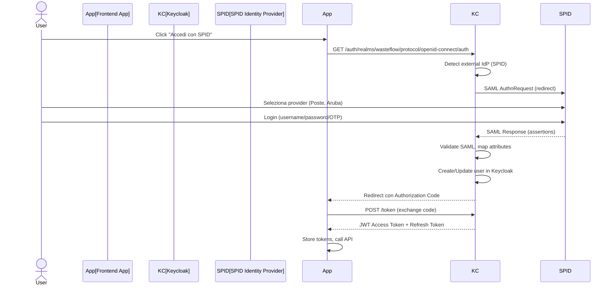

# ANALISI COMPARATIVA: KEYCLOAK VS AUTENTICAZIONE CUSTOM
## Sistema Gestione Rifiuti - Valutazione Architettura IAM

**Data:** 13 Ottobre 2025
**Versione:** 1.0
**Autore:** System Architect

---

## EXECUTIVE SUMMARY

### Situazione Attuale (Proposta nei Documenti)

**Stack Autenticazione:**
- **Identity Provider:** SPID/CIE (SAML 2.0) per identità digitale italiana
- **Session Management:** JWT custom (NestJS implementation)
- **Authorization:** RBAC custom con 5 ruoli (Prisma schema)
- **Multi-tenancy:** Row-Level Security PostgreSQL + UserTenant junction table
- **Audit:** Custom audit log (append-only PostgreSQL table)

### Proposta Alternativa: Keycloak

**Stack con Keycloak:**
- **Identity Provider:** SPID/CIE → **Keycloak (SAML Broker)** → App
- **IAM Platform:** Keycloak (Red Hat/Quarkus open source)
- **Session Management:** Keycloak JWT + refresh tokens
- **Authorization:** Keycloak RBAC + fine-grained permissions
- **Multi-tenancy:** Keycloak Groups/Custom Attributes + PostgreSQL RLS
- **Audit:** Keycloak Events + custom audit log

---

## 1. ANALISI DETTAGLIATA KEYCLOAK

### 1.1 Cos'è Keycloak

**Keycloak** è una piattaforma IAM (Identity and Access Management) enterprise-grade open source:
- **Proprietario:** Red Hat (IBM) / Quarkus Community
- **Licenza:** Apache 2.0 (gratuito, open source)
- **Tecnologia:** Java/Quarkus, PostgreSQL/MySQL
- **Standard:** OpenID Connect, OAuth 2.0, SAML 2.0
- **Adoption:** Netflix, Google, RedHat, governi EU

### 1.2 Funzionalità Chiave Keycloak

#### Authentication & Federation
- **Identity Brokering:** Integrazione SAML/OAuth con IdP esterni (SPID, Google, Active Directory)
- **Social Login:** Google, Facebook, GitHub (out-of-box)
- **MFA:** TOTP, SMS, WebAuthn
- **Passwordless:** WebAuthn, Magic Links

#### Authorization
- **RBAC:** Role-Based Access Control con gerarchia ruoli
- **ABAC:** Attribute-Based Access Control (policies basate su attributi utente)
- **Fine-Grained Permissions:** Authorization Services con UMA 2.0
- **Resource-Level Permissions:** Policy Enforcement Point (PEP) pattern

#### Multi-Tenancy
- **Realms:** Isolamento completo (1 realm = 1 tenant) - non scala per 100K tenant
- **Groups & Custom Attributes:** Multi-tenancy via metadati utente (scalabile)
- **Client Scopes:** Permessi specifici per applicazione

#### User Management
- **Admin Console:** UI grafica gestione utenti, ruoli, permessi
- **User Self-Service:** Password reset, profile update, 2FA setup
- **User Federation:** LDAP, Active Directory, custom providers
- **Impersonation:** Admin può impersonare utente (debugging)

#### Session Management
- **SSO (Single Sign-On):** Login una volta, accesso a N applicazioni
- **Token Management:** Access token (short-lived), Refresh token (long-lived)
- **Session Timeout:** Configurabile per realm/client
- **Revocation:** Logout globale, revoca token

#### Audit & Monitoring
- **Event Logging:** Login, logout, permessi negati, errori
- **Admin Audit:** Chi ha modificato configurazioni
- **Custom Events:** Estendibile con SPI

---

## 2. INTEGRAZIONE SPID + KEYCLOAK

### 2.1 Architettura SPID Brokering



### 2.2 Configurazione SPID in Keycloak

**Step Setup:**

1. **Configurare SPID come Identity Provider**
```bash
# Keycloak Admin Console
Identity Providers → Create Provider → SAML v2.0

- Alias: "spid"
- Display Name: "Accedi con SPID"
- Service Provider Entity ID: https://app.wasteflow.it/keycloak
- Single Sign-On Service URL: https://idp.spid.gov.it/sso
- Single Logout Service URL: https://idp.spid.gov.it/slo
- Principal Type: Subject NameID
- Principal Attribute: fiscalNumber
```

2. **Mappare Attributi SPID → Keycloak**
```yaml
Mappers:
  - Name: fiscalNumber
    Mapper Type: Attribute Importer
    Attribute Name: fiscalNumber
    User Attribute Name: fiscalNumber

  - Name: email
    Mapper Type: Attribute Importer
    Attribute Name: email
    User Attribute Name: email

  - Name: name
    Mapper Type: Attribute Importer
    Attribute Name: name
    User Attribute Name: firstName

  - Name: familyName
    Mapper Type: Attribute Importer
    Attribute Name: familyName
    User Attribute Name: lastName
```

3. **Registrare Service Provider su AgID**
- Generare metadata XML Keycloak
- Registrare su portale AgID SPID
- Configurare certificati firma/crittografia
- Test con ambiente demo SPID

**Complessità:** MEDIO-ALTA
- Configurazione SPID AgID richiede certificati qualificati
- Validazione metadata complessa
- Test multi-provider (Poste, Aruba, Sielte, Infocert)

---

## 3. GESTIONE MULTI-TENANCY CON KEYCLOAK

### 3.1 Approccio: Groups + Custom Attributes (CONSIGLIATO)

**Problema:** 1 Realm per tenant non scala (100K tenant = 100K realms = impossibile)

**Soluzione:** Single Realm + Groups gerarchici + Custom Attributes

```typescript
// Struttura Keycloak
Realm: wasteflow

Users:
  - marco@officina.it
    - Attributes:
        tenant_ids: ["tenant-123", "tenant-456"]  // Multi-tenant support
        default_tenant: "tenant-123"
    - Groups:
        - /tenant-123/ADMIN
        - /tenant-456/VIEWER

  - elena@consulente.it
    - Attributes:
        tenant_ids: ["tenant-789", "tenant-101", ... "tenant-835"]  // 35 clienti
        default_tenant: "tenant-789"
    - Groups:
        - /tenant-789/CONSULTANT_ADMIN
        - /tenant-101/CONSULTANT_ADMIN
        - ...

Groups Hierarchy:
  /tenant-123
    /ADMIN (role: admin_tenant-123)
    /OPERATOR (role: operator_tenant-123)
    /VIEWER (role: viewer_tenant-123)

  /tenant-456
    /ADMIN
    /OPERATOR
    /VIEWER
```

**JWT Claims Keycloak:**
```json
{
  "sub": "a1b2c3d4-uuid",
  "email": "marco@officina.it",
  "fiscalNumber": "FRRMRC80A01H501U",
  "realm_access": {
    "roles": ["user"]
  },
  "resource_access": {
    "wasteflow-app": {
      "roles": ["admin_tenant-123", "viewer_tenant-456"]
    }
  },
  "tenant_ids": ["tenant-123", "tenant-456"],
  "default_tenant": "tenant-123",
  "groups": ["/tenant-123/ADMIN", "/tenant-456/VIEWER"]
}
```

**Applicazione Backend (NestJS):**
```typescript
@Injectable()
export class KeycloakAuthGuard implements CanActivate {
  canActivate(context: ExecutionContext): boolean {
    const request = context.switchToHttp().getRequest()
    const token = this.extractJWT(request)

    // Parse JWT
    const payload = this.jwtService.verify(token)

    // Extract tenant from request (header o URL)
    const requestedTenant = request.headers['x-tenant-id'] || request.params.tenantId

    // Verify user has access to tenant
    if (!payload.tenant_ids.includes(requestedTenant)) {
      throw new ForbiddenException('User not authorized for this tenant')
    }

    // Set PostgreSQL context for RLS
    await this.prisma.$executeRaw`SET app.current_tenant = ${requestedTenant}`

    // Attach to request
    request.user = {
      id: payload.sub,
      email: payload.email,
      tenantId: requestedTenant,
      tenantIds: payload.tenant_ids,
      roles: payload.resource_access['wasteflow-app'].roles,
      groups: payload.groups
    }

    return true
  }
}
```

**Row-Level Security PostgreSQL (INVARIATO):**
```sql
-- Automatic tenant isolation (STESSO MECCANISMO)
CREATE POLICY tenant_isolation ON fir
  USING (tenant_id = current_setting('app.current_tenant')::uuid);
```

---

## 4. CONFRONTO DETTAGLIATO: KEYCLOAK VS CUSTOM

### 4.1 Matrice Comparativa

| Criterio | **Keycloak** | **Auth Custom** | Vincitore |
|----------|--------------|-----------------|-----------|
| **Time-to-Market** | -2 settimane (setup) | Baseline | ⚠️ Custom |
| **Complessità Setup** | ALTA (Java, PostgreSQL KC, config SPID broker) | MEDIA (SPID SAML, JWT NestJS) | ⚠️ Custom |
| **Gestione Utenti** | Admin Console UI (★★★★★) | Custom API/UI da sviluppare (★★) | ✅ Keycloak |
| **RBAC/Permissions** | Built-in fine-grained (★★★★★) | Custom implementation (★★★) | ✅ Keycloak |
| **Multi-tenancy** | Groups + Attributes (★★★★) | UserTenant junction (★★★★) | 🟰 Pari |
| **SSO** | Built-in (★★★★★) | Da implementare custom | ✅ Keycloak |
| **MFA/2FA** | Built-in (TOTP, WebAuthn) | Da implementare custom | ✅ Keycloak |
| **User Self-Service** | Built-in (password reset, profile) | Da implementare custom | ✅ Keycloak |
| **Audit Log** | Built-in Events (★★★★) | Custom (★★★) | ✅ Keycloak |
| **Scalabilità** | Clustering support (★★★★★) | Stateless JWT (★★★★★) | 🟰 Pari |
| **Costi Infra MVP** | +150€/mese (EC2 m5.large) | Incluso app server | ⚠️ Custom |
| **Costi Infra Scale** | +300€/mese (cluster 2 nodi) | Incluso | ⚠️ Custom |
| **Ops Burden** | Monitoring KC, backup DB KC, upgrades | Incluso backend | ⚠️ Custom |
| **Team Expertise** | Curva apprendimento Java/KC admin (★★) | TypeScript familiar (★★★★★) | ⚠️ Custom |
| **Vendor Lock-in** | Open source, portabile | Codice proprietario | ✅ Keycloak |
| **Maturità Prodotto** | Enterprise-grade (Netflix, Google) (★★★★★) | Da testare (★★) | ✅ Keycloak |
| **Debugging** | Complesso (KC logs + App logs) | Semplice (single stack) | ⚠️ Custom |
| **SPID Integration** | SAML Broker (config complessa) | SAML diretto (config complessa) | 🟰 Pari |
| **Performance** | +50ms latency (hop aggiuntivo) | Diretto | ⚠️ Custom |
| **Failure Impact** | KC down = no auth (SPOF) | App down = no auth (inevitabile) | 🟰 Pari |

**TOTALE:**
- ✅ **Keycloak vince:** 9 criteri
- ⚠️ **Custom vince:** 8 criteri
- 🟰 **Pari:** 3 criteri

---

### 4.2 Time-to-Market Impact

**Setup Keycloak (Effort Aggiuntivo):**

| Task | Effort | Rischio |
|------|--------|---------|
| Setup Keycloak infra (Docker Compose dev, ECS prod) | 3d | BASSO |
| Configurare Realm, Clients, Roles iniziali | 2d | BASSO |
| SPID Identity Brokering setup | 5d | **ALTO** |
| Test SPID multi-provider (Poste, Aruba, etc) | 3d | **ALTO** |
| Integrazione NestJS (keycloak-connect adapter) | 2d | MEDIO |
| Custom mappers Groups → Tenants | 2d | MEDIO |
| Admin UI personalizzazioni (branding) | 2d | BASSO |
| Migration strategy esistenti utenti | 2d | MEDIO |
| **TOTALE** | **21 giorni (4.2 settimane)** | |

**Impatto su Roadmap:**
- **Sprint 0:** +1 settimana (setup Keycloak infra)
- **Sprint 1:** +2 settimane (SPID brokering + test)
- **Sprint 2-7:** Effort risparmiato su features (Admin UI, MFA, Self-Service già built-in)

**Bilancio Time-to-Market:**
- **MVP (Sprint 0-7):** +3 settimane totali
- **Post-MVP (Sprint 8+):** -4 settimane risparmiate (no dev Admin UI, MFA, etc.)
- **Netto:** +3 settimane MVP, -1 settimana complessiva su 12 mesi

---

### 4.3 Costi Infrastruttura

**Keycloak Infrastructure (AWS):**

| Ambiente | Servizio | Spec | Costo/Mese |
|----------|----------|------|------------|
| **DEV** | EC2 t4g.medium | 2 vCPU, 4GB RAM | 30€ |
| **DEV** | RDS PostgreSQL t4g.micro | Keycloak DB | 15€ |
| **STAGING** | EC2 t4g.medium | Keycloak HA (1 nodo) | 30€ |
| **STAGING** | RDS PostgreSQL t4g.small | Keycloak DB | 25€ |
| **PROD MVP** | EC2 m5.large | Keycloak HA (2 nodi) | 140€ |
| **PROD MVP** | RDS PostgreSQL db.t4g.medium | Keycloak DB | 90€ |
| **PROD MVP** | ALB | Load balancer Keycloak | 20€ |
| **TOTALE MVP** | | | **+350€/mese** |
| **TOTALE Scale (10K users)** | | | **+500€/mese** |

**Custom Auth Infrastructure:**
- **Costo aggiuntivo:** 0€ (incluso in app server esistente)

**Delta:** +350€/mese MVP, +500€/mese Scale

---

### 4.4 Complessità Operativa

**Keycloak Operations:**

**PRO:**
- Gestione utenti via Admin Console (no dev effort)
- Built-in monitoring metrics (Prometheus)
- Clustering HA per resilienza
- Upgrade gestiti (Docker image updates)

**CONTRO:**
- **Dipendenza critica:** Keycloak down = no login/logout/token refresh
- **Monitoring aggiuntivo:** CloudWatch Keycloak + App
- **Backup aggiuntivo:** Database Keycloak separato
- **Troubleshooting complesso:** Logs Keycloak + App logs
- **Upgrade coordination:** Keycloak version + keycloak-connect library alignment

**Operational Burden:**
- **Team DevOps:** +20% effort (gestione cluster Keycloak)
- **On-call:** Keycloak diventa componente critico (SPOF se mal configurato)

---

## 5. ANALISI RISCHI

### 5.1 Rischi Keycloak

| Rischio | Probabilità | Impatto | Mitigazione |
|---------|-------------|---------|-------------|
| **SPID Brokering complessità oltre prevista** | ALTA | ALTO | Spike 1 settimana pre-Sprint 0, mock SPID se blocco |
| **Keycloak diventa SPOF (Single Point of Failure)** | MEDIA | CRITICO | HA clustering (2+ nodi), health check, monitoring |
| **Curva apprendimento team Java/Keycloak** | MEDIA | MEDIO | Training 2gg, documentazione interna, expert consultant |
| **Performance overhead (+50ms per hop)** | BASSA | BASSO | Accettabile per MVP, cache token client-side |
| **Vendor lock-in Keycloak** | BASSA | BASSO | Open source, export utenti/config possibile |
| **Upgrade breaking changes** | MEDIA | MEDIO | Pin version Keycloak, test upgrades staging |
| **Costi infra crescita imprevista** | BASSA | MEDIO | Monitoring costi AWS, ottimizzazione EC2 |

### 5.2 Rischi Custom Auth

| Rischio | Probabilità | Impatto | Mitigazione |
|---------|-------------|---------|-------------|
| **Security vulnerabilities JWT custom** | MEDIA | CRITICO | Security audit Sprint 7, penetration test |
| **Effort underestimato features auth** | ALTA | ALTO | Nessuna Admin UI, MFA, Self-Service nel MVP |
| **Reinventare la ruota (NIH syndrome)** | ALTA | MEDIO | Accettato per velocity MVP |
| **Scalabilità RBAC custom non sufficiente** | MEDIA | MEDIO | Refactoring futuro verso Keycloak |
| **Team expertise insufficiente security** | MEDIA | ALTO | Security consultant esterno, code review |

---

## 6. RACCOMANDAZIONE FINALE

### 6.1 Decisione: **CUSTOM AUTH per MVP, KEYCLOAK POST-MVP**

**Motivazione:** Approccio **pragmatico** basato su:
1. **Time-to-Market critico:** 3.5 mesi MVP non negoziabili
2. **Team size limitato:** 5-7 dev, no expertise Keycloak
3. **Complessità SPID Brokering:** Risk alto integrazione per MVP
4. **Costi contenuti MVP:** +350€/mese Keycloak significativo su budget 700€
5. **Features Auth MVP minime:** No Admin UI, no MFA, no Self-Service richiesti Sprint 0-7

**Strategia:**

#### FASE 1: MVP (Sprint 0-7, Mesi 1-4) - CUSTOM AUTH

**Implementazione:**
- SPID/CIE SAML diretto (passport-saml)
- JWT custom NestJS con claims: sub, email, tenantId, role, permissions
- RBAC 5 ruoli (Prisma schema User/Tenant/UserTenant)
- Row-Level Security PostgreSQL
- Audit log custom append-only

**PRO:**
- Velocity massima (no setup Keycloak)
- Stack uniforme TypeScript (no Java)
- Costi infra bassi
- Debugging semplificato (single stack)

**CONTRO:**
- No Admin UI (gestione utenti via API custom)
- No MFA built-in (da implementare post-MVP se richiesto)
- No User Self-Service (password reset, profile edit)
- Security risk più alto (custom implementation)

#### FASE 2: POST-MVP (Mesi 5-12) - MIGRATION A KEYCLOAK

**Trigger Migration:**
1. **User base >1.000 utenti** (gestione manuale utenti diventa bottleneck)
2. **Richieste MFA/2FA** da clienti enterprise
3. **Necessità Admin Console** per consulenti (self-service gestione clienti)
4. **SSO multi-applicazione** (es. app mobile + web + admin panel separato)
5. **Security audit** raccomanda IAM enterprise-grade

**Migration Plan:**

**Sprint 10-11 (2 settimane):**
- Setup Keycloak infra production
- Configurazione Realm, Clients, Roles iniziali
- SPID Identity Brokering (+ test multi-provider)

**Sprint 12 (1 settimana):**
- Export utenti esistenti da PostgreSQL → Keycloak
- Mapping User/Tenant/Roles → Keycloak Groups/Attributes
- Test parallelo auth custom + Keycloak

**Sprint 13 (1 settimana):**
- Switch graduale: Feature flag 10% traffico → Keycloak
- Monitoring errori, rollback se issues
- Incremento 10% → 50% → 100% traffico

**Sprint 14 (1 settimana):**
- Dismissione auth custom
- Cleanup codice SAML/JWT custom
- Documentazione nuova architettura

**Effort Migration:** 5 settimane (25 giorni)

---

### 6.2 ADR-004: Custom Auth MVP, Keycloak Post-MVP

**Status:** Accepted
**Date:** 2025-10-13
**Deciders:** CTO, Lead Architect, Product Manager

**Context:**
Sistema greenfield, team 5-7 dev, time-to-market 3.5 mesi MVP critico. Necessità autenticazione SPID + multi-tenancy + RBAC. Trade-off tra velocity (custom auth) e features enterprise (Keycloak).

**Decision:**
Implementare autenticazione custom per MVP (Sprint 0-7), migrare a Keycloak post-MVP (Sprint 10-14) quando user base >1K e richieste features enterprise.

**Consequences:**
- **Positive:**
  - Time-to-market MVP preservato (no +3 settimane Keycloak setup)
  - Costi infra MVP -350€/mese
  - Stack uniforme TypeScript (no Java/Keycloak learning curve)
  - Debugging semplificato (single stack)

- **Negative:**
  - No Admin UI MVP (gestione utenti via API custom)
  - No MFA built-in (da implementare se richiesto)
  - Security risk più alto (custom implementation)
  - Effort migration post-MVP (5 settimane)

- **Mitigation:**
  - Security audit Sprint 7 (penetration test)
  - Architettura preparata per migration (JWT standard, RBAC pulito)
  - Feature flag per switch graduale Keycloak
  - Documentazione migration plan dettagliato

**Review Trigger:**
- User base >1.000 utenti
- Richieste MFA da clienti enterprise
- Security audit raccomanda Keycloak

---

## 7. PIANO IMPLEMENTAZIONE CUSTOM AUTH MVP

### 7.1 Task Sprint 1 (già pianificato)

**TASK 1.2: SPID Authentication Mock + Stub (M - 8 SP)** - CONFERMATO

```typescript
// apps/backend/src/auth/spid/spid-auth.service.ts
import { SAML } from 'passport-saml'

export class SPIDAuthService {
  private saml: SAML

  constructor(config: SPIDConfig) {
    this.saml = new SAML({
      entryPoint: config.idpUrl,
      issuer: config.spEntityId,
      cert: config.idpCertificate,
      privateKey: config.spPrivateKey,
    })
  }

  generateAuthnRequest(): string {
    return this.saml.generateAuthorizeRequest()
  }

  async validateResponse(samlResponse: string): Promise<SPIDUserAttributes> {
    const profile = await this.saml.validatePostResponse({ SAMLResponse: samlResponse })
    return {
      fiscalNumber: profile.attributes.fiscalNumber,
      name: profile.attributes.name,
      familyName: profile.attributes.familyName,
      email: profile.attributes.email,
    }
  }
}
```

**Acceptance Criteria:**
- SPID SAML AuthnRequest generation
- SAML Response validation + signature check
- Mock SPID IDP per test environment
- Stub reale PosteID test environment
- Endpoints: GET `/auth/spid/login`, POST `/auth/spid/callback`
- JWT generation post-auth
- **NO** Keycloak dependency

---

### 7.2 Preparazione Future Migration

**Design Principles per facilitare migration:**

1. **JWT Standard Claims**
```typescript
// Utilizzare claim names compatibili OpenID Connect
{
  "sub": "user-uuid",           // OIDC standard
  "email": "user@example.com",  // OIDC standard
  "preferred_username": "user", // OIDC standard
  "tenant_ids": ["tenant-1"],   // Custom claim (compatibile Keycloak)
  "resource_access": {          // Keycloak-style (già compatibile)
    "wasteflow-app": {
      "roles": ["admin_tenant-1"]
    }
  }
}
```

2. **Separazione Auth Module**
```typescript
// apps/backend/src/auth/
├── auth.module.ts           // Modulo isolato
├── interfaces/
│   ├── auth-service.interface.ts  // Interface generica
│   └── jwt-payload.interface.ts   // JWT standard
├── spid/
│   └── spid-auth.service.ts       // SPID implementation
├── jwt/
│   └── jwt-auth.service.ts        // JWT custom implementation
└── guards/
    └── jwt-auth.guard.ts          // Guard generico
```

3. **Environment-Based Auth Provider**
```typescript
// auth.module.ts
@Module({
  providers: [
    {
      provide: 'AUTH_SERVICE',
      useFactory: (config: ConfigService) => {
        const authProvider = config.get('AUTH_PROVIDER') // 'custom' | 'keycloak'
        return authProvider === 'keycloak'
          ? new KeycloakAuthService()
          : new CustomAuthService()
      },
      inject: [ConfigService]
    }
  ]
})
export class AuthModule {}
```

**Benefit:** Switch auth provider con ENV var, no code changes

---

## 8. CONCLUSIONI

### 8.1 Sintesi Decisionale

| Aspetto | Custom Auth | Keycloak | Scelta MVP |
|---------|-------------|----------|------------|
| **Time-to-Market** | 3.5 mesi | 4.2 mesi (+3 settimane) | ✅ **Custom** |
| **Costi MVP** | 700€/mese | 1.050€/mese (+50%) | ✅ **Custom** |
| **Features MVP** | Sufficienti | Over-engineered | ✅ **Custom** |
| **Features Scale** | Limitato (no MFA, Admin UI) | Enterprise-grade | ⚠️ **Keycloak** |
| **Team Expertise** | Alta (TypeScript) | Bassa (Java/KC) | ✅ **Custom** |
| **Security** | Medio (custom code) | Alto (battle-tested) | ⚠️ **Keycloak** |
| **Ops Complexity** | Basso | Alto | ✅ **Custom** |
| **Vendor Lock-in** | Custom code | Open source portabile | 🟰 **Pari** |

**Decisione Finale:**
- **✅ Custom Auth per MVP (Sprint 0-7)**
- **✅ Migration Keycloak Post-MVP (Sprint 10-14)**

### 8.2 Key Takeaways

1. **Pragmatismo > Purismo:** Custom auth subottimale teoricamente, ma ottimale per context (startup MVP, team piccolo, time-to-market critico)

2. **Exit Strategy Documentata:** Architettura preparata per migration (JWT standard, modulo auth isolato, feature flag)

3. **Technical Debt Accettato:** 5 settimane effort migration post-MVP accettabile vs +3 settimane ritardo MVP

4. **Keycloak = Future-Proof:** Quando scale (>1K utenti, clienti enterprise), Keycloak diventa necessario

5. **Security Non Negoziabile:** Security audit Sprint 7 obbligatorio per custom auth

---

### 8.3 Prossimi Step

**Immediati (Sprint 0-1):**
1. ✅ Confermare decisione Custom Auth con stakeholder
2. ✅ Implementare SPID SAML diretto (no Keycloak) - Task 1.2
3. ✅ Design JWT claims compatibili OIDC
4. ✅ Documentare architettura auth isolata (preparazione migration)

**Post-MVP (Sprint 10+):**
1. Valutare trigger migration (user base, richieste MFA, security audit)
2. Se trigger attivo: avviare Sprint 10-14 migration Keycloak
3. Setup Keycloak infra, SPID brokering, export utenti
4. Switch graduale con feature flag
5. Dismissione auth custom

---

**Documento Preparato da:** System Architect
**Versione:** 1.0
**Prossima Revisione:** Post-MVP (Mese 4) per valutazione trigger migration Keycloak

---

**RACCOMANDAZIONE: APPROVATA ✅**

**Motivazione:** Approccio bilanciato che preserva time-to-market MVP (critico) mantenendo opzionalità future (Keycloak post-MVP quando necessario). Trade-off tecnico (technical debt migration) accettabile vs benefit business (launch 3 settimane prima, costi -350€/mese).
